> [MiniOB](https://github.com/oceanbase/miniob) 是 [OceanBase](https://github.com/oceanbase/oceanbase) 联合华中科技大学推出的一款用于教学的小型数据库系统，希望能够帮助数据库爱好者系统性的学习数据库原理与实战。

本篇文章介绍如何使用 [GitPod](https://www.gitpod.io/) 开发 [MiniOB](https://github.com/oceanbase/miniob)。
也可以参考这篇文章了解如何使用 Visual Studio Code 来开发调试 MiniOB。

# GitPod 简介
[GitPod](https://www.gitpod.io/) 是一个能让我们在任何地方都能方便开发自己代码的云平台。在开发时，GitPod会提供一个虚拟机一样的开发环境，开发平台是Linux，并且GitPod可以直接打开GitHub项目，支持很多IDE，比如Visual Studio Code、Clion、VIM等。


本篇文章将介绍如何在GitPod上使用Visual Studio Code（浏览器版）来开发MiniOB。

# 在 GitPod 上开发自己的 MiniOB

## 创建自己的GitHub项目

在开发MiniOB之前，应该先在GitHub上将MiniOB放在自己的私有仓库中。为了方便演示，我这里直接使用fork的方式，在自己的个人仓库中创建一个共有(public)仓库。

在浏览器中打开 [MiniOB](https://github.com/oceanbase/miniob) 然后fork仓库

  fork后就会在自己的个人名下有一个miniob仓库代码

  


## 在 GitPod 上打开自己的项目

使用 [GitPod](https://www.gitpod.io/) 打开自己的项目

> 如果是第一次使用，需要输入一些额外的信息，按照GitPod的引导来走就行，最终会引导你打开你的项目。

  

  

  这里选择自己的代码项目，并且使用vscode浏览器版本，容器规格也选择最小的（最小的规格对miniob来说已经非常充足）
  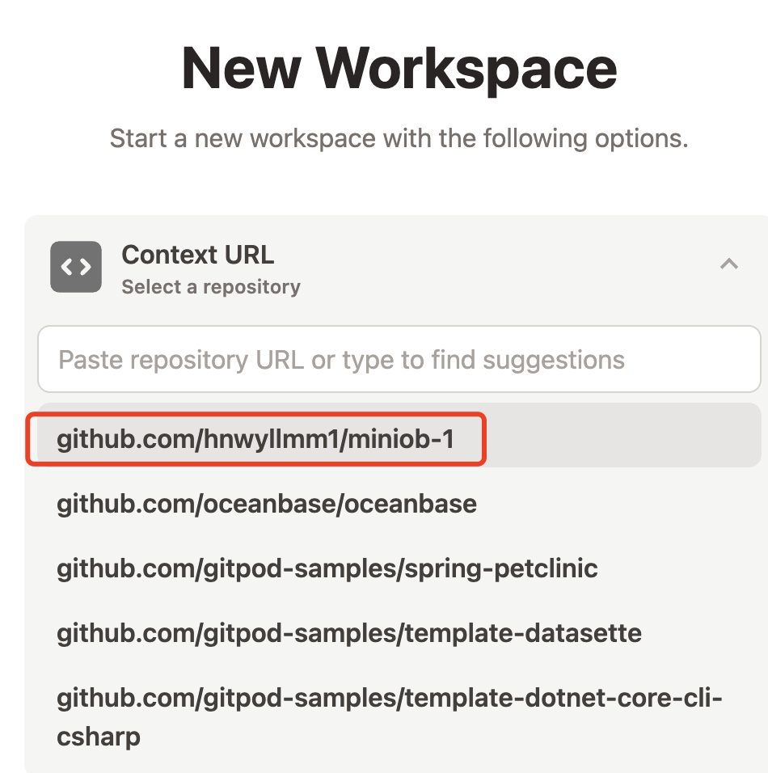

  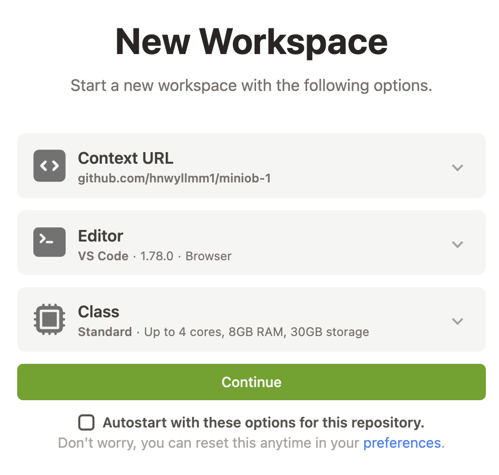

  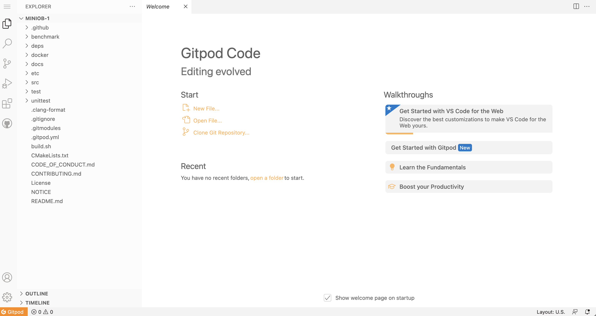


如果以前已经操作过上面的步骤，可以直接从gitpod的首页找到自己的项目。

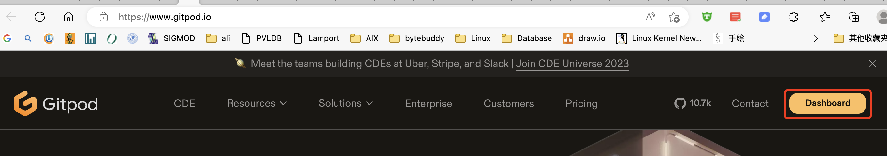

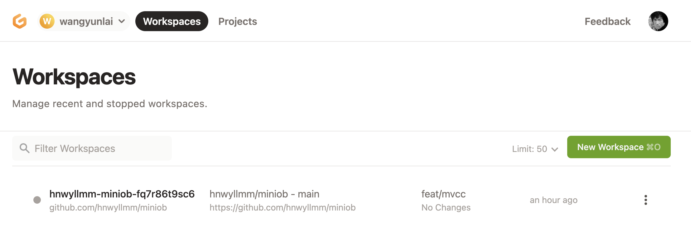

## 代码构建

**环境初始化**
因为MiniOB当前已经将.vscode文件加入到项目中，所以可以直接使用当前已有的一些命令(task)来构建代码。
如果是一个全新的机器环境，那么先要运行 `init` 任务。init 任务会在当前的机器上安装一些依赖，比如 google test、libevent等。

> NOTE: gitpod 项目启动时，就会自动运行初始化。如果没有运行，可以手动执行一下。可以参考 .gitpod.yml 文件

**编译miniob**
初始化完成，可以运行 `Build` 任务，即可构建。

这些构建方法，也可以通过命令行的方式手动执行。

所有的任务都可以从这里找到入口。


运行 init 命令的入口。

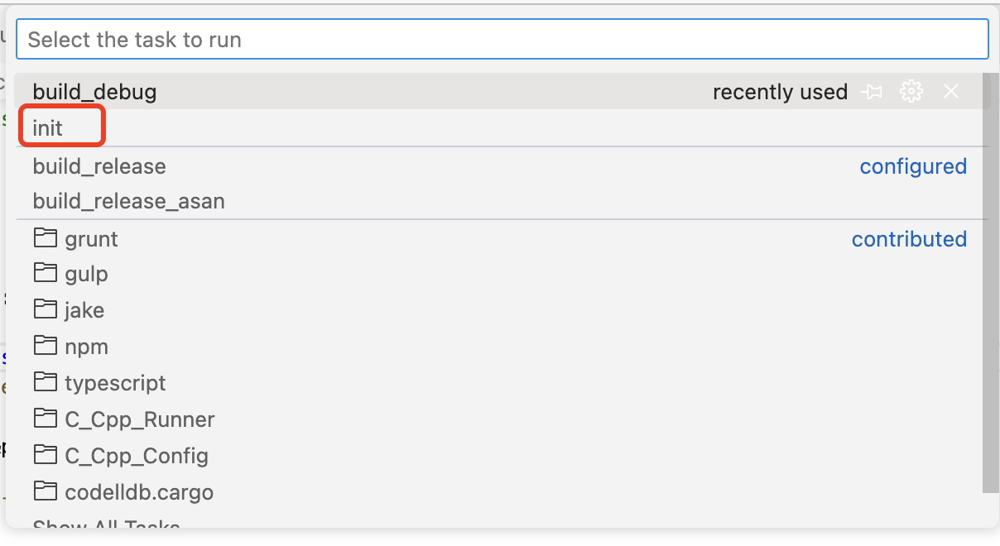


运行构建（编译）的入口。需要设置默认构建的任务，vscode才能运行。这里已经设置过了。


构建（编译）时，会有一些输出，如果有编译错误，也可以直接使用鼠标点击跳转到错误的地方。


还可以构建其它模式。

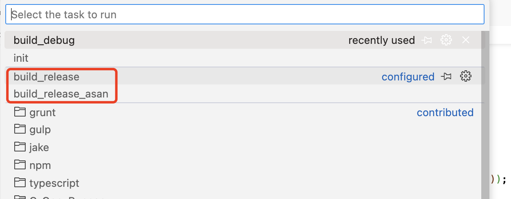

> WARNING: 不要在gitpod的终端上，执行 sh build.sh，而是执行 bash build.sh 或者直接运行 ./build.sh

miniob 虽然是cmake功能，可以使用vscode带的cmake配置，但是miniob在编译时，会使用一些变量来控制编译什么版本，比如是否编译UNITTEST，是否开启ASAN等。因此这里使用build.sh脚本来简化项目的编译命令。

## 代码调试
与代码构建类似，MiniOB 可以支持在vscode中直接启动调试程序。启动的调试程序为默认构建项目，当前是 debug 模式编译的miniob。
与普通的调试类似，可以自行设置断点。断点可以在运行程序之前也可以在其后。
启动调试服务端后，打开一个新的终端，来运行客户端，以便向服务端发起命令。

**下断点**

光标放到某一行，vscode编辑框的左边就会出现一个粉红色的圆点，点击圆点就可以下断点
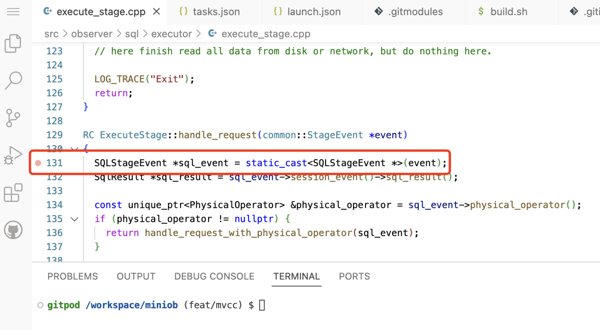

圆点变成红色，断点下成功了。


**启动调试**


vscode 为调试进程也创建了一个终端，可以在这里看到observer运行期间在控制台上的输出。


调试时显示的界面。可以看到最上面中央处，有一个调试的界面，可以执行单步调试，或者跳转到函数内。这与普通的调试器界面类似。左边有一些变量的展示。

另外，我这里开了一个终端，运行客户端连接服务端发起命令请求。

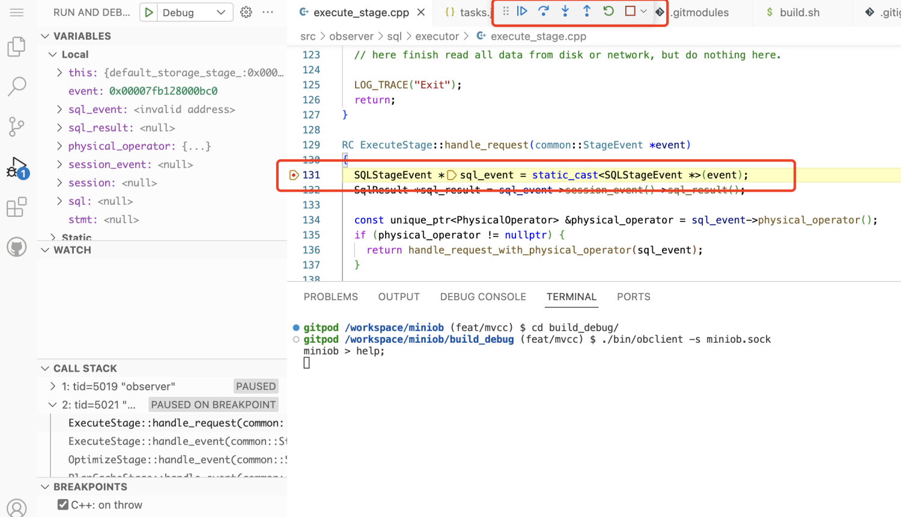


## 代码提交
作为一个GitHub项目，一个功能或者BUG开发完成后，需要将代码推送到远程仓库。vscode已经集成了GitHub和git插件，可以方便的进行操作。

完成一个功能，就提交一次。这里输入commit message后直接提交即可。

注意这里仅仅提交到了本地，如果要提交到GitHub（远程仓库），需要执行”推送“，即 git push。


Git的其它操作链接在这里

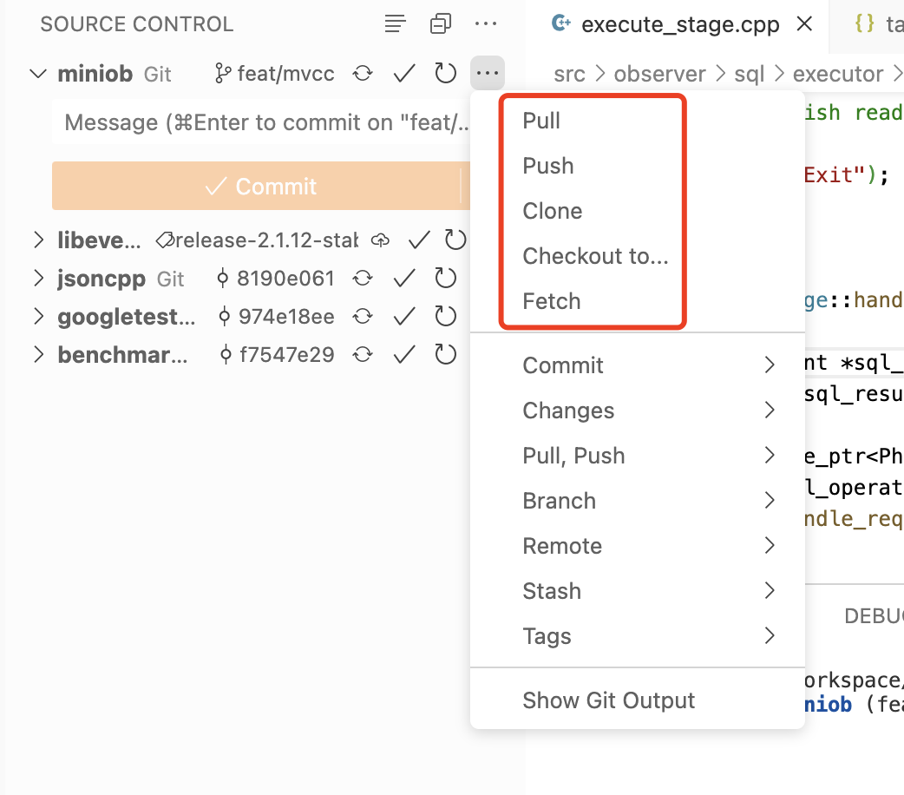

如果推送时出现这样的错误，可能是没有权限。gitpod 会自动提示然后跳转过去设置权限即可。


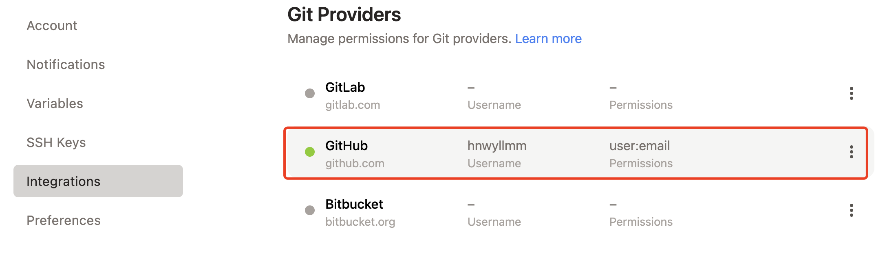

我这里就是没有写权限，所以无法推送到远程仓库。


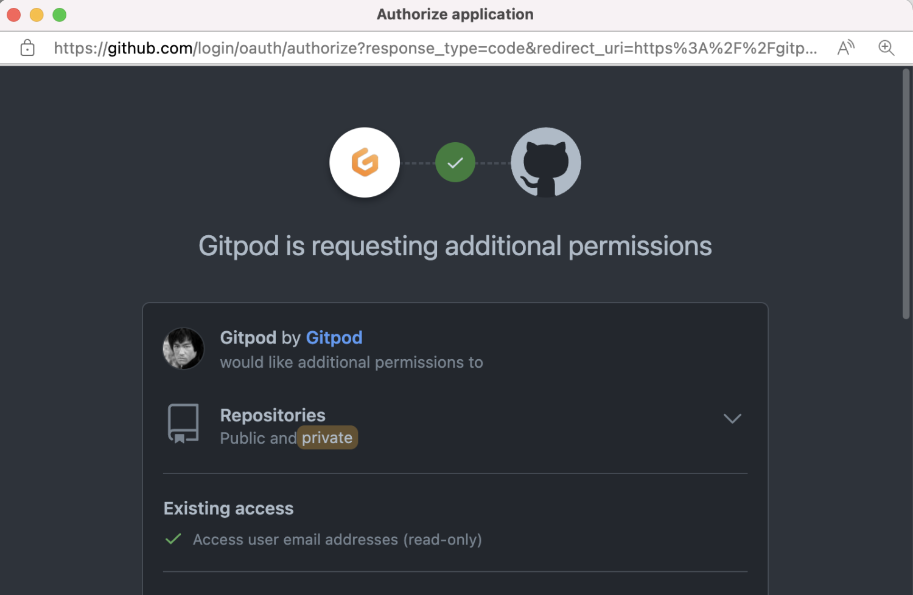

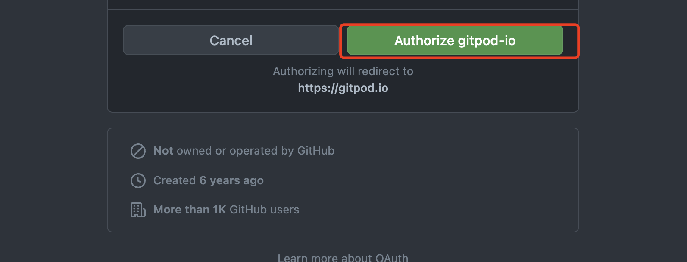


# 信息介绍

## MiniOB 中的 tasks

vscode 可以非常方便的运行任务(task)来运行预配置的命令，比如shell。
miniob 的编译也可以通过脚本来执行(build.sh)。这里预配置了几个编译任务，可以按需自取，也可以按照需要，增加新的配置，运行自己的参数。

下面是一个 debug 模式编译的示例，也是vscode工程默认的Build配置。这里做个简单介绍，以方便大家有需要的时候，修改配置满足自己需要。
其中 
- `label` 是一个任务名字，在 `Run task`的时候，可以看到
- `type` 表示任务的类型。这里是一个shell脚本
- `command` 这里是一个shell脚本的话，那command就是运行的命令，跟我们在终端上执行是一样的效果
- `problemMatcher` 告诉vscode如何定位问题。这里不用设置，vscode可以自动检测
- `group` 使用vscode将此任务设置为默认Build任务时，vscode自己设置上来的，不需要调整。

```json
{
    "label": "build_debug",
    "type": "shell",
    "command": "bash build.sh debug",
    "problemMatcher": [],
    "group": {
        "kind": "build",
        "isDefault": true
    }
}
```

## MiniOB 中的 launch

很多同学不习惯使用gdb的终端界面来调试程序，那么在 vscode 中调试miniob非常方便，与Visual Studio、Clion中类似，都有一个操作界面。
vscode中启动调试程序是通过launch.json来配置的，这里简单介绍一下主要内容。

下面是截取的一段关键内容。这里介绍一些关键字段
- `type` 当前调试使用哪种类型。这里是lldb (我个人习惯了gdb，但是我没有找到，也不想找了)
- `name` 这里会显示在vscode调试窗口启动时的名字中
- `program` 要调试的程序。对miniob来说，我们通常都是调试服务端代码，这里就是observer的路径。workspaceFolder 是当前工程的路径，defaultBuildTask 是默认构建的任务名称，与我们的构建路径刚好一致。observer 是编译完成安装在构建路径的bin下。
- `args` 启动程序时的命令行参数。在终端上，大家也可以这么启动observer: `./bin/observer -f ../etc/observer.ini -s miniob.sock
- `cwd` observer 运行时的工作目录，就是在observer程序中获取当前路径时，就会是这个路径。

```json
{
    "type": "lldb",
    "request": "launch",
    "name": "Debug",
    "program": "${workspaceFolder}/${defaultBuildTask}/bin/observer",
    "args": ["-f", "${workspaceFolder}/etc/observer.ini", "-s", "miniob.sock"],
    "cwd": "${workspaceFolder}/${defaultBuildTask}/"
}
```

注意，如果要调试 release 或者其它任务编译出来的observer，就需要调整这个文件，或者新增一个配置，因为这个配置文件指定的observer路径是默认的build。

