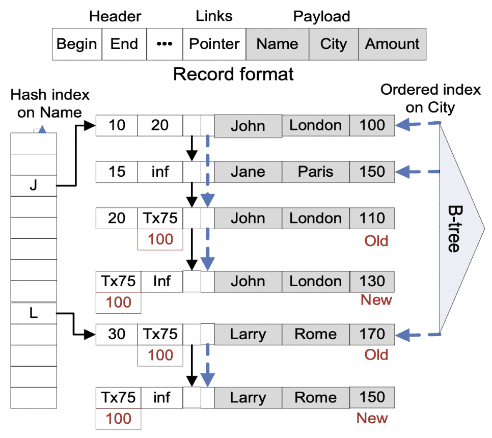
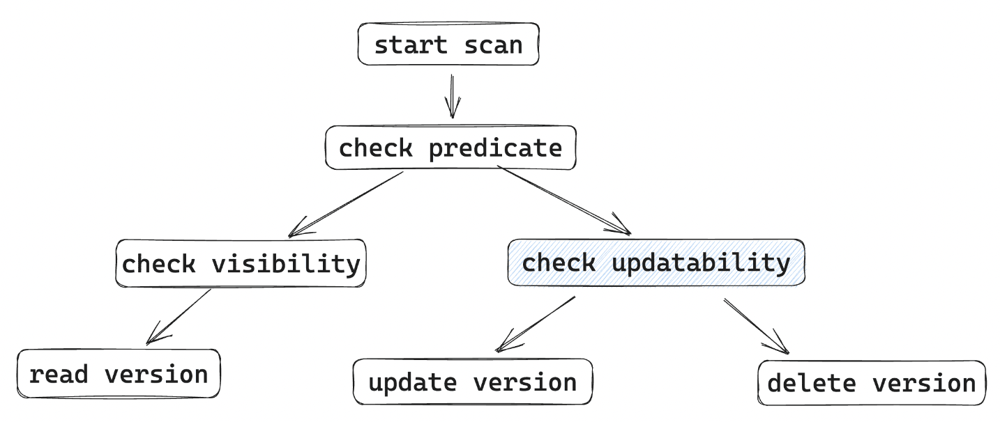
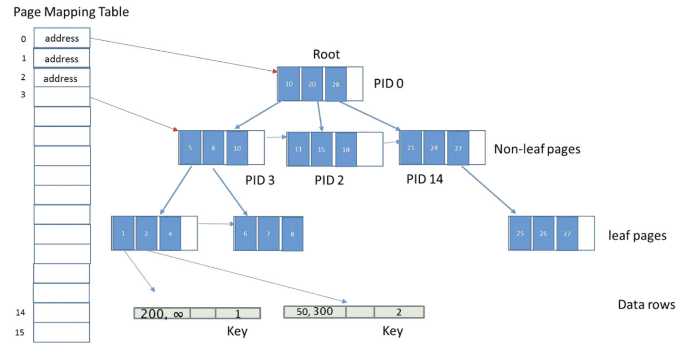

> 本篇文章来自 [OceanBase](https://github.com/oceanbase/oceanbase) 内部论文分享

本篇文章分享的论文是[《High-Performance Concurrency Control Mechanisms for Main-Memory Databases》](https://www.microsoft.com/en-us/research/wp-content/uploads/2011/12/MVCC-published-revised.pdf),该论文介绍了微软SQL Server内存数据库Hekaton所使用的并发控制算法原型，提出了一种无锁的乐观并发控制以及一种无锁的悲观并发控制方法，最终Hekaton采用的是其中的乐观并发控制方法，其也是第一个在生产中将OCC落地的数据库。欢迎感兴趣的同学一起交流学习~

# Background
本篇论文讨论内存数据库(Main-Memory Database)中MVCC的设计。

## Main-Memory Database
产生背景：
- 服务器内存大小不断增加（TB级）
- 服务器处理器核数不断增加
- 内存价格持续下降

特点：
- 表数据完全存在内存中，无需从磁盘读取
- 进行针对性优化，如无锁结构、无锁并发控制方法等
- 性能优异

## SQL Server Hekaton
集成在SQL Server中针对内存数据以及OLTP负载进行优化的数据库引擎。
优化点：
- 优化内存索引
- 无锁结构
- 解释执行

## Hekaton Concurrency Control Mechanism
论文介绍了Hekaton高性能事务并发控制算法的原型方法，基于事务不阻塞的原则以及MVCC技术，介绍了一种无锁的多版本悲观并发控制（PCC）以及一种无锁的多版本乐观并发控制（OCC）策略，并实现了面向内存优化的单版本加锁基线方案，在不同场景对这三种方法进行了测试与比较。

这里的事务不阻塞不是说永远不等待，是说不等锁。
不阻塞的好处是会有更少的上下文切换。

# MVCC Storage Engine
## 存储和索引

**设计原则**

避免等待，设计为lock-free

论文以 lock-free hashtable index为例，介绍并发控制策略，也可用于trees以及skip list等顺序索引结构中。


**Record**

- 包含Name、Amount两列
- 包含Begin、End字段，存储时间戳或事务id，代表该版本有效时间范围
- 相同hash bucket版本通过指针相连，从旧到新
- 与原型基本结构相同
- 增加将相同key的version连接的指针
- 增加了一个无锁B-tree（Bw-tree）用于范围查询，叶子节点指向第一个版本
- 可同时存在多个hash index（见附录）



## 事务执行
1. Active：事务创建，获取开启时间戳
2. Normal processsing phase：事务执行。
3. Preparation phase：若commit，则将新version以及delete版本相关信息写redo log并等待日志持久化
4. Postprocessing phase：commit成功则替换新旧版本中事务ID为事务end时间戳；abort则将事务ID替换为infinity
5. Transaction terminated：旧版本通过garbage colloctor


## 版本可见性
RT为事务T读取时间，

**场景一、Begin与End都为时间戳**

TBegin <= RT < TEnd则可读

**场景二、Begin为 TB 事务ID**

TB状态     | TB的结束时间戳     | 事务T检查版本V的记录是否可见
--------- | ---------------- | ---------
Active    | 未设置            | 只有TBeigin=T并且V的结束时间戳是infinity才可见
Preparing | TS               | V的开始时间戳是TS但是V还没有提交。使用TS作为V的开始时间戳来检测可见性
Committed | TS               | V的开始时间戳就是TS
Aborted   | 不相关            | 忽略，这是一个垃圾版本
Terminated<br/>或没找到 | 不相关 | 重新读取V的Begin字段

**场景三、End 为 TE 事务ID**

TE状态     | TE的结束时间戳     | 事务T检查版本V的记录是否可见
--------- | ---------------- | ---------
Active    | 未设置            | TE=T就可见
Preparing | TS               | V的结束时间戳会在提交时变成TS。如果TS>RT,就可见
Committed | TS               | 使用TS做可见性判断
Aborted   | 不相关            | V可见
Terminated<br/>或没找到 | 不相关 | 重新读取V的结束时间戳字段

## 版本更新
事务只允许更新最新版本V：
- V的结束时间戳字段End是infinity
- V End 字段=TE事务，事务TE Aborted
- V End 字段=TE事务，事务TE是Active或Preparing，产生写写冲突，采用first-write-win策略，事务终止

## Commit 依赖
如果T1必须在T2提交后才能提交，那就认为T1依赖T2：
- 提前读
- 提前忽略

每个事务增加：
- CommitDepCounter：commit依赖事务数
- AbortNow：是否需要abort
- CommitDepSet：依赖于本事务commit的事务ID

如果事务T2提交成功，就将T1 的 CommitDepCounter 减1并唤醒它。
如果事务T2 Abort，那就将 T1 的AbortNow置为1。

Commit依赖将所有的等待步骤都推迟到了Commit阶段。
事务在commit之前很可能不需要等待，因为很可能它依赖的事务也都提交了。
也免去了死锁问题，总是年轻事务等待年老事务。

# Optimistic Concurrency Control
## 事务维系数据集合

串行化级别：
- ReadSet: 所读版本
- ScanSet: 重复scan操作所需要的信息
- WriteSet: 新旧版本指针

## Normal Processing Phase
包含Index Scan定位对应版本以及读/写。
可串行化级别下，使用事务开始时间作为读操作TS。


1. Start Scan: 执行scan操作，记录scan信息
2. Check Predicate: 谓词检查
3. Check visibility: 可见性判断，同时添加commit依赖
4. Read Version: 读数据，记录指针到ReadSet
5. Check Updatability: 确定版本可以更新；可提前更新，前提是该版本的事务已经完成normal processing
6. Update Version: 执行更新，插入新版本，旧版本end修改为事务ID(失败就abort)，写入WriteSet
7. Delete Version: 修改旧版本end字段为事务ID，记录其指针到WriteSet



**PreCommit**

- 获取事务end ts（commit ts）
- 设置事务状态为Preparing
- 进入Preparation phase

## Preparation Phase
1. Read validation: 
  - 可重复读检查。重新扫描ReadSet，确认版本仍然可见
  - 幻读检查: 重新执行ScanSet中的扫描，检查是否有新版本

2. Wait for commit dependencies
  - 等待所有依赖事务提交， CommitDepCounter=0
  - 未通过或者AbortNow=1，就abort,进入 postprocessing phase

3. Logging
  - 将创建的新版本、删除版本的信息写入日志

设置事务状态：aborted/committed

## Postprocessing Phase
成功commit就把TS写到旧版本end字段和新版本的begin字段。
如果abort就把WriteSet中的新版本end字段设置为infinity，新版本start字段设置为infinity。
这里的abort动作不会阻塞其它事务。

## Low Level Isolation

**Repeatable read**

不需要做幻读检查。读操作使用事务开始时间。

**Snapshot Isolation**

不做可重复读检查与幻读检查，使用事务开始时间作为读操作时间戳。

**Read Committed**

不做可重复读检查与幻读检查。读操作使用当前时间。

**Read-only Transaction**

SI 或者 RC隔离级别性能更好

# Pessimistic Concurrency Control
## 事务维系数据集合
串行化级别：
- ReadSet: 事务读到的版本数据
- BucketSet: 访问上锁的bucket集合
- WriteSet: 新旧版本指针

## Lock Types

### Record Lock
- 保证可重复读
- 只对最新版本加锁
- 使用Record End 字段实现(64 bits)


### Bucket Lock(Range Locks)
- 避免幻读
- 存储于hash bucket中，扫描的时候上锁

数据结构：
```
LockCount: 上锁的数目
LockList: 加锁的事务
```

## Eager update & Wait-For Dependencies
可串行化场景下，传统的多版本加锁方法更新/删除某一行，下面的场景会导致阻塞：
- 行已经加了read lock
- Bucket 已经加锁

**Eager Update**

允许对有read lock和bucket lock的bucket进行update。

但是锁释放之前不允许precommit 进入preparing阶段。
还需要添加wait-for依赖。

## Wait-For Denpendencies

一个事务有以下结构：
```
WaitForCounter: 事务依赖的的个数
NoMoreWaitFors: 不允许再添加wait-for依赖
WaitingTxnList: 依赖当前事务结束的事务集合
```

Wait-For类型：
- Read Lock Denpendency
- Bucket Lock Denpendency

## Read Lock Denpendencies
一个事务TU想要对版本V更新或删除，但是V已经有了read lock：
- 将TU的事务ID写入V的 WriteLock 字段
- ReadLockCounter > 0，TU WaitForCounter加1

事务TR对V加读锁：
- NoMoreReadLocks=true 或 ReadLockCount=max_value，TR abort
- ReadLockCounter > 0，将其加1
- 若已存在事务TU添加的write lock，且TR为第一个读锁，检查TU NoMoreWaitFor，若true，abort，否则强制TU等待TR（添加wait-for依赖）

事务 TR 对版本 V 释放read lock
- 不存在write lock，直接将ReadLockCounter减1
- 存在write lock 且 ReadLockCounter > 1，同上
- 存在write lock 且 ReadLockCounter = 1， ReadLockCounter置为0，并将其NoMoreReadLocks置为1，TU WaitForCounter减1避免后续read lock进一步阻塞TU commit

## Bucket Lock Denpendencies
允许Bucket提前插入，但需要上锁事务完成，才能进行precommit，通过添加wait-for依赖实现。

TU在Bucket B插入/删除新版本：
- B不存在Bucket lock，直接上锁事务维系结构
- B存在Bucket lock
  - TU NoMoreWaitFors=true，TU abort
  - TU NoMoreWaitFors=false，对B LockList事务添加wait-for依赖

这时是TU给自己加了一个依赖(Wait-For Denpendency)。

事务TS scan Bucket B，发现满足查询条件但不可见版本V，且更新其事务TU为Active，为避免幻读，需添加wait-for依赖：
- TU NoMoreWaitFors=true，TS abort
- TU NoMoreWaitFors=false：TU添加到自身WaitingTxnList；将TU WaitForCounter加1

这时是TS给TU添加依赖。

## Normal Processing Phase
阶段/控制策略 | OCC | PCC
----------- | --- | ---
Start Scan  | 记录Scan信息到ScanSet(Serializable) | 对Scan的Bucket加锁，放入BUcketLockSet(Serializable)
Check Predicate | 条件检查 | 条件检查
Check Visibility | 可见性判断，commit 依赖条件添加 | 与OCC相同，但是需要添加Wait-For依赖(Serializable)
Read Version | 读版本指针存入ReadSet(Serializable、RR) | 添加read lock（Serializable、RR）
Check Updatability | 可更新检查，commit依赖添加 | 与OCC相同
Update Version | 更新，加入WriteSet | 更新，添加wait-for依赖
Delete Version | 删除，加入WriteSet | 删除，添加wait-for依赖
Process End | Precommit | wait-for等待，precommit，释放read/bucket lock

## Preparation Phase
不需要做Read Validation。
直接等待commit denpendencies。
然后记录日志。

## Postprocessing Phase
与乐观并发控制一致，通过修改版本的begin、end字段，隐式释放写锁。

# Experimental Results
## 实验环境
- 2-socket CPU，共12核24线程，NUMA架构，访问remote memory比local memory慢30%
- Log异步刷盘，组提交避免IO带宽成为瓶颈
- 测试0 - 24线程，24线程CPU利用率最高，加线程吞吐下降

实现面向内存优化的单版本加锁（1V）方案作为基线，测试不同场景1V、OCC（MV/O）以及PCC（MV/L）的表现。

## 同构负载-RC
低竞争：
- 多版本管理以及垃圾回收开销，吞吐不如1V
- MV/L 比 MV/O慢30%，依赖追踪以及锁的额外写导致内存流量增加

高竞争：
- 热点数据访问cache同步导致核间流量大
- MV/O表现最好

## Higher Isolation Level
固定24线程，改变隔离级别：
- 加锁方式，RR级别损失很小<2%；MV/O 可重复读检查，损失8%
- Serializable：1V > MV/L > MV/O
- MV/O需要承担更多隔离级别造成的性能损失

## 异构负载—短只读事务影响
低竞争：
- 只读比例增加，gap减小——多版本以及垃圾回收代价减小
- 绝大多数只读，MV比1V好，纯只读MV相同，1V略差

高竞争：
80%是只读，MV比1V高73%以及63%——MV只读不影响写

## 异构负载—长只读事务影响
存在长事务时更新吞吐：
- 存在1个长事务，1V下降75%，MV下降5%，MV为1V两倍
- 50%长事务，MV为1V 80倍

存在长事务时读吞吐：
MV优于1V

# Conclusion
- 可在获取锁不成为瓶颈的情况下有效的实现1V-Lock方式
- 1V-Lock方式在短事务、低竞争下表现好，但不同场景适应性很差
- 高竞争以及存在长事务时MVCC优于1V-Lock
- MVCC-O表现比MVCC-P好

悲观并发控制：访问数据时加锁，有可能需要等待锁释放
乐观并发控制：假设数据一般不会造成冲突，只在事务提交时进行冲突检测

最终Hekaton所采用为其中的乐观并发控制（OCC）方法。而基于磁盘的数据库通常采用悲观并发控制（PCC）方法，其解释原因如下：
- 在对数据update时进行冲突检测（写写冲突）
- 假设前提不同：
  - 基于磁盘的PCC事务tx1 等到tx2 回滚时才能继续，tx2 commit产生conflict error（假设tx2会提交失败）
  - 基于内存的PCC事务tx1 直接产生conflict Error（假设tx2会提交成功）

## Main-Memory Database Concurrency Control Mechanisms
Main-Memory 数据库 | 并发控制方法 | 支持隔离级别
----------------- | ----------- | -----------
Microsoft Hekaton | MVCC-O(lock-free) | Serializable, RR, SI, RC(single stmt)
Oracle TimesTen | Single-version + multiple-lock | Serializable, RC
SAP HANA | MVCC-P(lock) | Serializable, SI, RC
IBM SolidDB | Single-version + multiple-lock | RR, RC
VoltDB | Deterministic Concurrency Control | Serializable

# References
- [Hekaton: SQL Server’s Memory-Optimized OLTP Engine](https://www.microsoft.com/en-us/research/wp-content/uploads/2013/06/Hekaton-Sigmod2013-final.pdf)
- [SQL Server In-Memory OLTP Internals for SQL Server 2016](https://learn.microsoft.com/en-us/sql/relational-databases/in-memory-oltp/sql-server-in-memory-oltp-internals-for-sql-server-2016?view=sql-server-ver16)
- OCC的前世今生

# 附录

