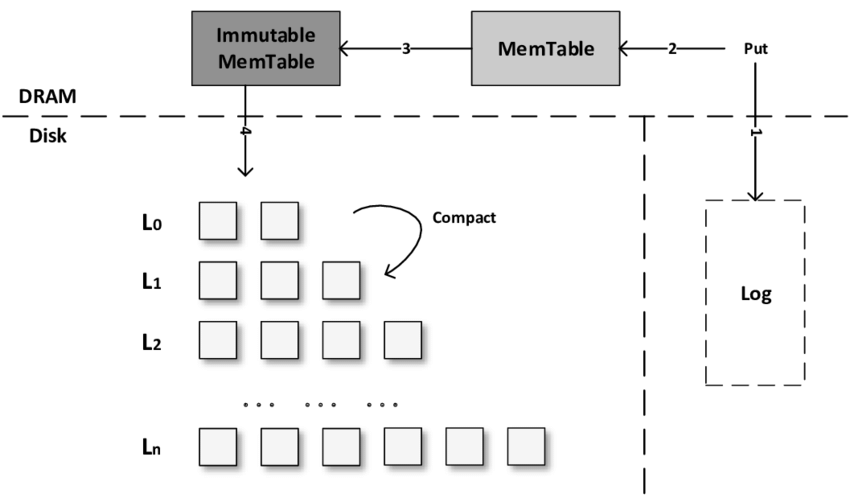

> 请不要将代码提交到公开仓库（包括提交带有题解的 Pull Request），同时也请不要抄袭其他同学或网络上可能存在的代码。

# LAB#1 LSM-Tree 存储引擎

这是数据库系统实现原理与实践课程的第一个正式实验题目，实验内容是完成 LSM-Tree 存储引擎中的部分功能。

每次实验代码更新，需要将代码从远端仓库拉取下来，大家需要从 miniob 的 github 仓库上把代码拉取到本地。

```
1. git remote add origin_ob https://github.com/oceanbase/miniob.git
2. git pull origin_ob
3. git merge origin_ob/main
4. 解决git冲突
5. 实现代码，推送到自己的github仓库上
```

## LSM-Tree 简介
LSM-Tree 将写操作（包括数据插入、修改、删除）采用追加写的方式写入内存中并进行排序（MemTable），当 MemTable 的大小达到一定阈值后再将数据顺序写入磁盘中（Sorted Strings Table, SSTable），这使得 LSM-Tree 具有优秀的写性能；但是读操作时需要查询 MemTable 和 SSTable 中数据。因此，为了提高读性能，LSM-Tree会定期对磁盘中的SSTable文件进行合并（Compaction），合并时会将相同数据进行合并，减少数据量。



## OceanBase 中的 LSM-Tree 简介
OceanBase 数据库的存储引擎也是基于 LSM-Tree 架构，将数据分为静态基线数据（放在 SSTable 中）和动态增量数据（放在 MemTable 中）两部分，其中 SSTable 是只读的，一旦生成就不再被修改，存储于磁盘；MemTable 支持读写，存储于内存。数据库 DML 操作插入、更新、删除等首先写入 MemTable，等到 MemTable 达到一定大小时转储到磁盘成为 SSTable。在进行查询时，需要分别对 SSTable 和 MemTable 进行查询，并将查询结果进行归并，返回给 SQL 层归并后的查询结果。同时在内存实现了 Block Cache 和 Row cache，来避免对基线数据的随机读。关于 OceanBase 数据库的更多细节可以参考：https://www.oceanbase.com/docs/oceanbase-database-cn

## MiniOB 中的 LSM-Tree 简介
ObLsm 是 MiniOB 中的一个为教学设计的 LSM-Tree 架构的 KV 存储引擎。可以认为 ObLsm 是一个独立的模块，MiniOB 集成了 ObLsm 作为其一个存储引擎，ObLsm 也可独立运行，独立使用。ObLsm 本身包含了 LSM-Tree 中的关键结构，可以帮助大家学习 LSM-Tree 架构。ObLsm 的代码位于 `src/oblsm/` 目录下，目前 LAB#1 实验仅需修改该目录下的代码即可。关于 ObLsm 的更多细节可参考[文档](../design/miniob-lsm-tree.md)。

## 实验

LAB#1 中包含三个相对独立的子任务：

- 任务1: 实现SkipList 并支持 SkipList 无锁并发写入
- 任务2: 实现 Block Cache 功能，加速 SSTable 的读取，实现 SSTable 组织数据的功能。
- 任务3: 实现 Leveled Compaction 功能，支持 SSTable 的合并

对于上述的每个实验，代码中均提供了包含必须实现的 API 的类及其接口。请不要修改这些类中预定义函数的定义/类名/文件名等。否则，测试脚本可能无法正常运行。你可以在这些类中添加成员变量和函数，以正确实现所需的功能。

### 任务1: 实现 SkipList 并支持 SkipList 无锁并发写入


#### 需要修改的文件
* `src/oblsm/memtable/ob_skiplist.h`

#### 需要实现的函数:

 * `ObSkipList::find_greater_or_equal`   
 * `ObSkipList::insert` 插入接口
 * `ObSkipList::insert_concurrently` 无锁并发查找接口

#### 测试的代码

查看测试用例检查接口的实现。

 *  `unittest/oblsm/ob_skiplist_test.cpp`
  
目前，ObLsm 中的 MemTable 基于 SkipList 实现，当前的 SkipList 支持一写多读(并发读不需要额外的同步机制，并发写需要外部的同步机制保证线程安全)。SkipList 中的部分函数还没有实现，请在此基础上实现 SkipList 的插入接口和无锁并发写接口（**注意：除了这一接口外，可能还需要实现其他必要函数，以支持 SkipList 正常运行，请自行 debug 或查看相关代码文件。**）。要求使用 CAS 操作来实现 SkipList 的无锁并发插入。下面对必要的知识做简单介绍。**注意：无锁 insert 接口不需要集成进lsm-tree 中，只需要通过单测文件中的测试即可。**

#### CAS（Compare-And-Swap）

CAS（Compare-And-Swap）是一种广泛用于并发编程中的原子操作，主要用于实现无锁数据结构和算法。它允许线程安全地对共享数据进行更新，而无需使用锁，从而提高了系统的性能和可伸缩性。

CAS 操作的基本思想是：通过比较某个内存位置的当前值（预期值）和一个给定的值，如果两者相等，那么将内存位置的值更新为一个新值；否则不更新。这个操作是原子的，也就是说，它要么完全成功，要么完全失败，不会出现中间状态。

CAS 通常由硬件提供支持，现代处理器通常都提供相应的指令。

在 C++ 中，CAS 操作通常通过 `std::atomic` 类型和 `compare_exchange_weak()` 或 `compare_exchange_strong()` 函数来实现。`compare_exchange_strong()/compare_exchange_weak()` 是 `std::atomic` 类模板的成员函数，其基本语义是比较一个原子变量的当前值与预期值，如果相等，则将其更新为新值。如果不相等，则将原子变量的当前值赋值给预期值（使调用者知道失败原因）。这个操作是原子的，保证了线程安全。

**思考**：`compare_exchange_weak()` 和 `compare_exchange_strong()` 的区别是什么？在实现这一任务时，你应该使用哪一个还是任意一个都可以？

cpplings(`./src/cpplings`) 中也提供了一个练习 CAS 的例子，可参考 `src/cpplings/cas.cpp`，本练习不作为实验的一部分，不计入成绩，仅供练习参考。

#### 跳表（SkipList）

跳表 (SkipList) 是由 William Pugh 发明的一种查找数据结构，支持对数据的快速查找，插入和删除。

跳表的期望空间复杂度为 $O(n)$，跳表的查询，插入和删除操作的期望时间复杂度都为 $O(\log n)$。

顾名思义，SkipList 是一种类似于链表的数据结构。更加准确地说，SkipList 是对有序链表的改进。

一个有序链表的查找操作，就是从头部开始逐个比较，直到当前节点的值大于或者等于目标节点的值。很明显，这个操作的复杂度是 O(n)。

跳表在有序链表的基础上，引入了分层的概念。首先，跳表的每一层都是一个有序链表，特别地，最底层是初始的有序链表。每个位于第 i 层的节点有 p 的概率出现在第 i+1 层，p 为常数。

在跳表中查找，就是从第 L(n) 层开始，水平地逐个比较直至当前节点的下一个节点大于等于目标节点，然后移动至下一层。重复这个过程直至到达第一层且无法继续进行操作。此时，若下一个节点是目标节点，则成功查找；反之，则元素不存在。这样一来，查找的过程中会跳过一些没有必要的比较，所以相比于有序链表的查询，跳表的查询更快。可以证明，跳表查询的平均复杂度为 $O(\log n)$。

插入节点的过程就是先执行一遍查询的过程，中途记录新节点是要插入哪一些节点的后面，最后再执行插入。每一层最后一个键值小于 key 的节点，就是需要进行修改的节点。

你需要补充完善 `src/oblsm/memtable/ob_skiplist.h` 以下函数，以实现 SkipList 的基本功能。
```c++
/**
 * @brief Insert key into the list.
 * REQUIRES: nothing that compares equal to key is currently in the list
 */
void insert(const Key &key);
```

**提示**：除了这一接口外，可能还需要实现其他必要函数，以支持 SkipList 正常运行，请自行 debug 或查看相关代码文件。

#### SkipList 的无锁并发插入

SkipList 的无锁并发插入可以参考 [The Art of Multiprocessor Programming](https://www2.cs.sfu.ca/~ashriram/Courses/CS431/assets/distrib/AMP.pdf) 中的实现。相关细节位于书中的 14.4 节。

无锁插入的核心部分伪代码如下：
``` c++
Node *node = new_node(key);
while(true) {
  // find the location to insert the new node.
  // `prev` is less than `key`, `succ` is greater than `key`.
  find(key, prev, succ);
  // no synchronization needed here, because `node` is
  // not yet visible to other threads.
  node->next[i] = succ[i]

  if (!prev[0].next[0].cas_set(succ[0], node)) {
    // if failed, try again.
    continue;
  }

  for (int level = 1; level < N/* N is the top level*/; level++) {
    while (true) {
      if (prev[level].next[level].cas_set(succ[level], node)) {
        // success to insert the node at level i
        break;
      }
      // if failed, try again.
      find(key, prev, succ);
    }
  }
  return;
}
```

注意：

1. 在实现 `insert_concurrently()` 请不要使用任何锁。
2. 需要考虑 `common::RandomGenerator` 的线程安全。可参考：https://stackoverflow.com/questions/77377046/is-a-stdmt19937-static-function-variable-thread-safe


#### 测试

可以通过运行 `unittest/oblsm/ob_skiplist_test.cpp` 来测试 skiplist 的功能。

MiniOB 中的单测框架使用 `GTest`，在默认参数编译后，单测二进制程序位于 `$BUILD_DIR/bin/` 目录下，程序名与单测文件名对应。例如，`ob_skiplist_test.cpp` 对应的单测程序为 `$BUILD_DIR/bin/ob_skiplist_test`，通过运行该程序即可测试你的实现是否正确。

测试用例中会随机生成一些键值对，并插入到 SkipList 中。然后对 SkipList 进行查找操作，检查查找结果是否正确。

**注意**：你需要保证你的 SkipList 实现是线程安全的。

**思考**：在插入新节点的过程中，通过 CAS 操作来逐层添加节点，那么如果 CAS 失败后，是否需要回滚掉之前成功插入的节点？为什么？

**思考**：多个 CAS 操作并不是原子的，也就是在插入过程中，多个读线程可能看到不一致的新节点，会导致什么问题？

### 任务2：实现 Block Cache（块缓存） 功能，加速 SSTable 的读取，实现 SSTable 组织数据的功能

**注意要查看数据组织的相关文档：**
[MiniOB LSM-Tree 设计文档](../design/miniob-lsm-tree.md)

#### 需要修改的文件

##### 1. 数据组织

* `src/oblsm/table/ob_block.cpp`
* `src/oblsm/table/ob_sstable.cpp`
* `src/oblsm/table/ob_sstable_builder.cpp`
* 
##### 2. 块缓存

* `src/oblsm/memtable/src/oblsm/util/ob_lru_cache.h`

#### 需要实现的函数:

##### 1. 数据组织

  * `ObBlock::decode` 
    从给定的二进制数据中解析并提取出特定格式的数据，数据组织可以参考上面的文档和`ObBlockBuilder`中的代码。

  * `ObSSTable::init`  
    `ObSSTable`初始化，初始化`file_reader_`和`block_metas_`

  * `ObSSTable::read_block_with_cache`
  
  * `ObSSTable::read_block`
    从文件中读取一个`ObBlock`。
  
  * `ObSSTableBuilder::build`
    从`memtable`构建一个`ObSSTable`，注意查看`ObSSTableBuilder`内部函数和变量来实现。

##### 2. 块缓存

* `ObLRUCache::get`
* `ObLRUCache::put`
* `ObLRUCache::contains`
* `ObLRUCache<Key, Value> *new_lru_cache(uint32_t capacity)`

#### 测试的代码

查看测试用例检查接口的实现。
 * `unittest/oblsm/ob_block_test.cpp`
 * `unittest/oblsm/ob_table_test.cpp`
 * `unittest/oblsm/ob_lru_cache_test.cpp`

每个 SSTable 是由多个 Block构成。

Block Cache (块缓存)是 LSM-Tree 在内存中缓存数据以供读取的地方。Block Cache 的作用是优化热点数据访问磁盘时的I/O性能。ObLsm 中使用 LRU Cache 来实现块缓存。

LRU Cache（Least Recently Used）是一种常见的缓存淘汰算法。用于在有限的缓存空间中管理数据对象。LRU Cache 的核心思想是基于时间局部性原理，即最近被访问的数据在未来可能会被再次访问。

Cache 的容量有限，因此当 Cache 的容量用完后，而又有新的内容需要添加进来时，就需要挑选并舍弃原有的部分内容，从而腾出空间来放新内容。LRU Cache 的替换原则就是将最近最少使用的内容替换掉。

#### Block Cache 实现内容

你需要实现 `src/oblsm/util/ob_lru_cache.h` 中的 `ObLruCache` 类，实现 LRU 缓存的功能。
你需要在 SSTable 上实现 `read_block_with_cache()` 函数。

Block 通过 `(sst_id, block_id)` 作为 Key 进行缓存。如果命中了缓存，则从缓存中获取 Block；如果未命中缓存，则填充 Block 到缓存中。


**提示**：在实现 Block Cache 时，需要保证其线程安全。
**提示**：除了本文中提到的需要修改的位置，你还可能需要完成其他必要的修改以支持 Block Cache 正常运行，请自行 debug 或查看相关代码文件。

**思考**：在 RocksDB 中，块缓存通过 `strict_capacity_limit` 配置项来控制块缓存大小是否严格限制在块缓存容量内。在你的实现中，块缓存大小是否有可能会超过块缓存容量？

**思考**：LRU Cache 需要保证并发安全，你是通过什么方式保证这一点的？LevelDB/RocksDB 中都使用了分片的方式来减少锁冲突优化 LRU Cache 的并发性能，是否可以在你的实现中也使用分片来减少锁冲突？

### 测试

可以通过运行 `unittest/oblsm/ob_lru_cache_test.cpp` 来测试 LRU Cache 的功能。

### 任务3：实现 Leveled Compaction 功能，支持 SSTable 的合并

#### Compaction 简介
##### Leveled Compaction
在 Leveled Compaction 中，LSM-Tree 划分为 N 个 Level，每个 Level 仅包含一个 Sorted Run(相同层级的 SSTable 之间 Key 范围不存在交集)；相邻 Level 的 SSTable 大小有一个倍数关系。

Compaction 的触发是由于某个 Level 的数据量超过了阈值。在 Compaction 时会选择 L(n-1) 的数据，与原有 L(n) 的数据 Rowkey 有交集的部分进行合并，得到新的 L(n) 数据。

##### Tiered Compaction
在 Tiered Compaction 中，LSM-Tree 也被划分为 N 个 Level，每个 Level 可以包含多个 SSTable。相同 Level 的 SSTable 的 key range 可能存在交集。在查询时需要访问这个 Level 所有的 SSTable，使得读放大比较严重，查询性能不佳。

Compaction 的触发条件是某个 Level 的 SSTable 数量超过了阈值，会将 L(n) 的若干 SSTable，合出一个新的 SSTable 放入 L(n+1)，并不与原有 L(n+1) 的数据进行合并。相比于 Leveled 而言执行速度会更快，写放大会更优，但由于查询的 SSTable 数量变多，读放大会更差。

#### Compaction 实现内容

你需要实现 Leveled Compaction 功能，在 `src/oblsm/compaction/compaction_picker.h` 中实现 `LeveledCompactionPicker`。实现 `ObLsmImpl::try_major_compaction` 中的`TODO: apply the compaction results to sstables`，实现 `ObLsmImpl::do_compaction()` 函数。

**提示**：除了本文中提到的需要修改的位置，你还可能需要完成其他必要的修改以支持 Leveled Compaction 正常运行，请自行 debug 或查看相关代码文件。

ObLsm 中的 Leveled Compaction 需要满足下面规则：

1. 磁盘上的文件按多个层级（Level）进行组织。我们称它们为1级、2级等，或简称为L1、L2等，层级数由`ObLsmOptions::default_levels` 指定。特殊的 level-0（或简称 L0）包含刚刚从内存写入缓冲区（memtable）刷新的文件。
2. 每个级别（ L0 除外）都仅包含一个 Sorted Run(相同层级的 SSTable 之间 Key 范围不存在交集)。
3. 每个层级（L1 及以上）之间的数据大小存在倍数关系:`L_{i+1} = L_{i} * k`，其中 k 由`ObLsmOptions::default_level_ratio` 指定，L1 层级的数据大小由`ObLsmOptions::default_l1_level_size` 指定。
4. L0 层级受限于文件数，当超过指定文件数时触发合并。`ObLsmOptions::default_l0_file_num` 指定 L0 层级的文件数上限。
5. 每次合并时，L0 层级会全部参与合并，并从 L1 层级中挑选出存在数据交集的所有 SSTable 也参与合并。对于 L1 及以上层级的合并，从 L_i 层挑选出同层中最后参与合并的文件进行合并，并从 L_{i+1} Level 中挑选出存在数据交集的所有 SSTable 也参与合并。
6. 当多个 Level 触发压缩条件时，需要选择先压缩哪个级别。每个 Level 都会生成一个分数：对于非零级别，分数是级别的总大小除以目标大小。对于 level-0，分数是文件总数除以 default_l0_file_num。 
测试：

**思考**：在当前的实现下，ObLsm 还有哪些优化空间？请列出一些优化方向。

**提示**: 在做 LAB#1 实验时，可暂时不考虑 `ObLsmImpl::seq_`（用于实现 MVCC）。

#### 测试

可以通过运行 `unittest/oblsm/ob_compaction_test.cpp` 来测试 Leveled Compaction 功能。此外，还需要保证可以通过 `unittest/oblsm/ob_lsm_test.cpp` 和 `benchmark/oblsm_performance_test.cpp` 保证在增加 Compaction 后，不影响 LSM-Tree 的功能。

Q：如何运行 `benchmark/oblsm_performance_test.cpp`？
A：通过如下编译命令编译时，对应二进制文件位于`$BUILD_DIR/bin/`目录下，文件名为`oblsm_performance_test`。

```bash
bash build.sh release -DCONCURRENCY=ON -DWITH_BENCHMARK=ON
```
`ob_lsm_test` 和 `oblsm_performance_test` 作为集成性质的测试，可能要在完成上述所有任务后才会通过。
## 参考资料
这里提供了一些学习资料供大家参考学习。
[The Art of Multiprocessor Programming](https://www2.cs.sfu.ca/~ashriram/Courses/CS431/assets/distrib/AMP.pdf)
[name that compaction algorithm](https://smalldatum.blogspot.com/2018/08/name-that-compaction-algorithm.html)
[MiniOB LSM-Tree 设计文档](../design/miniob-lsm-tree.md)
