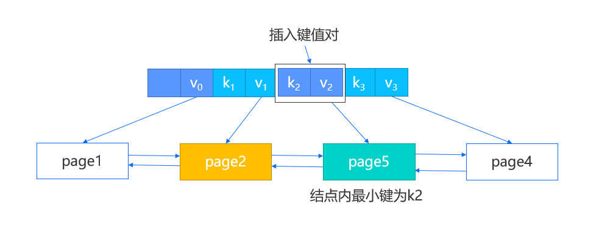
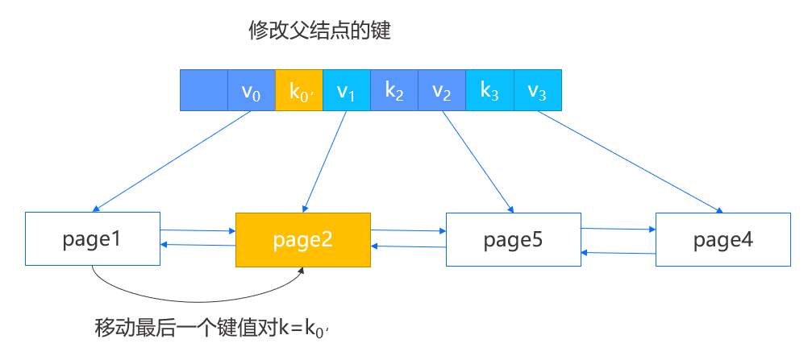

# MiniOB B+Tree 实现

## 简介

在基本的逻辑上，MiniOB 的 B+Tree 和 B+Tree 是一致的，查询和插入都是从根逐层定位到叶结点，然后在叶结点内获取或者插入。如果插入过程发生叶结点满的情况，同样会进行分裂，并向上递归这一过程。

如上图，每个结点组织成一个固定大小的 page，之前介绍过每个 page 首先有一个 page_num 表示 page 在文件中的序号，每个结点 page 都有一个common header 实现为 IndexNode 结构，其中包括 is_leaf（是否为叶结点）、key_num（结点中 key 的个数）、parent（结点父结点的 page num），当 parent=-1 时表示该结点没有父结点。

除此之外，Leaf page 还有 prev_brother（左结点的 page num）和 next_brother（右结点的 page num），这两项用于帮助遍历。最后 page 所剩下的空间就顺序存放键值对，叶结点所存放的 key 是索引列的值加上 RID（该行数据在磁盘上的位置），Value 则为 RID，也就是说键值数据都是存放在叶结点上的，和 B+Tree 中叶结点的值是指向记录的指针不同。

内部结点和叶结点有两点不同，一个是没有左右结点的 page num；另一个是所存放的值是 page num，也就是标识了子结点的 page 位置。如上图所示，键值对在内部结点是这样表示的，第一个键值对中的键是一个无效数据，真正用于比较的只有 k1 和 k2。

所有的结点（即 page）都存储在外存的索引文件 IndexFile 中，其中文件的第一个 page 是索引文件头，存储了一些元数据，如 root page 的 page num，内部结点和叶子结点能够存储键值对的最大个数等。

上图是一个简单的 MiniOB B+Tree 示例，其中叶结点能够访问到左右结点，并且每个结点能够访问到父结点。我们能够从 IndexFile 的第一个 page 得到 root page，而在知道一棵 B+Tree 的 root page 以后就足够访问到任意一个结点了。查询时我们会从 root page 开始逐层向下定位到目标叶结点，在每个 page 内遍历搜索查找键。

## 插入

在插入时，我们首先定位到叶结点，如下图中的 page2，然后在结点内定位一个插入位置，如果结点未满，那么将键值对插入指定位置并向后移动部分数据即可；如果结点已满，那么需要对其进行分裂。

我们将先创建一个新的右兄弟结点，即 page5，然后在原结点内保留前一半的键值对，剩余的键值对则移动到新结点，并修改 page2 的后向 page num，page5 的前后向 page num 以及 page4 的前向 page num，再根据之前定位的插入位置判断是插入 page2 还是 page5 ，完成叶结点的插入。

此外，由于我们新增了结点，我们需要在父结点也插入新的键值对，这一步将涉及到原结点，新结点以及新结点中的最小键，分为以下两种情况：

1. 有父结点，那么直接将新结点中的最小键以及新结点的 page num 作为键值对插入父结点即可。
   

2. 假设此时没有父结点，那么我们将创建一个新的根结点，除了把新结点键值对插入，还会将原结点的 page num 作为第一个键值对的值进行插入。

   

如果父结点的键值对插入同样触发了分裂，我们将按上述的步骤递归执行。

## 删除

正常的删除操作我们就不再介绍，这里介绍一些涉及结点合并的特殊情况。

首先在结点内删除键值对，然后判断其中的键值对数目是否小于一半，如果是则需要进行特殊处理。比如 page2 中删除一个键值对，导致其键值对数目小于一半，此时通过它的父结点找到该结点的左兄弟，如果是最左边的结点，则找到其右兄弟。

- 如果两个结点的所有键值对能容纳在一个结点内，那么进行合并操作，将右结点的数据迁移到左结点，并删除父结点中指向右结点的键值对。
  
   

- 如果两个结点的所有键值对不能容纳在一个结点内，那么进行重构操作。

  - 当所删除键值对的结点不是第一个结点时，那么选择将左兄弟的最后一个键值对移动到当前结点，并修改父结点中指向当前结点的键。

    

  - 当所删除键值对的结点是第一个结点时，那么选择将右兄弟的第一个键值对移动到当前结点，并修改父结点中指向右兄弟的键。

    

在上述两种操作中，合并操作会导致父结点删除键值对，因此会向上递归地去判断是否需要再次的合并与重构。
