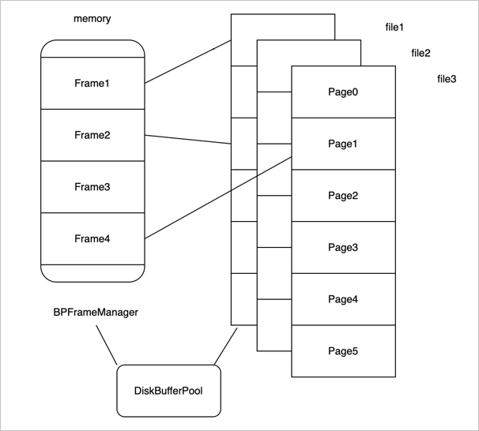
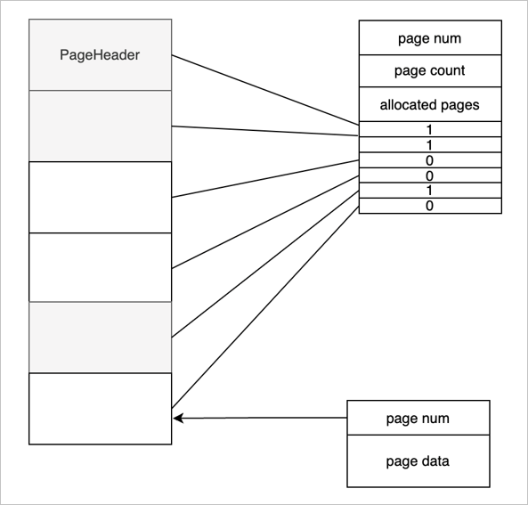

# MiniOB 存储实现

本节将从存储层面介绍 MiniOB 的实现。

## MiniOB 框架简介

首先回顾一下 MiniOB 的框架，在 MiniOB 概述章节已经简单的介绍过，本节重点介绍执行器（Executor）访问的存储引擎。

存储引擎控制整个数据、记录是如何在文件和磁盘中存储，以及如何跟内部 SQL 模块之间进行交互。存储引擎中有三个关键模块：

- Record Manager：组织记录一行数据在文件中如何存放。

- Buffer Pool：文件跟内存交互的关键组件。

- B+Tree：索引结构。

## MiniOB 文件管理

首先介绍 MiniOB 中文件是怎么存放，文件需要管理一些基础对象，如数据结构、表、索引。数据库在 MiniOB 这里体现就是一个文件夹，如下图所示，最上面就是一个目录，MiniOB 启动后会默认创建一个 sys 数据库，所有的操作都默认在 sys 中。

一个数据库下会有多张表。上图示例中只有三张表，接下来以 test1 表为例介绍一下表里都存放什么内容。

- test1.table：元数据文件，这里面存放了一些元数据。如：表名、数据的索引、字段类型、类型长度等。

- test1.data：数据文件，真正记录存放的文件。

- test1-i_name.index：索引文件，索引文件有很多个，这里只展示一个示例。

## MiniOB Buffer Pool 模块介绍

Buffer Pool 在传统数据库里是非常重要的基础组件。

首先来了解一下为什么要有一个 Buffer Pool ，数据库的数据是存放在磁盘里的，但不能直接从磁盘中读取数据，而是需要先把磁盘的数据读取到内存中，再在 CPU 做一些运算之后，展示给前端用户。写入也是一样的，一般都会先写入到内存，再把内存中的数据写入到磁盘。这种做法也是一个很常见的缓存机制。

接着来看 Buffer Pool 在 MiniOB 中是如何组织的。如上图所示，左边是内存，把内存拆分成不同的帧（frame）。假如内存中有四个 frame，对应了右边的多个文件，每个文件按照每页来划分，每个页的大小都是固定的，每个页读取时是以页为单位跟内存中的一个 frame 相对应。

Buffer Pool 在 MiniOB 里面组织的时候，一个 DiskBufferPool 对象对应一个物理文件。所有的 DiskBufferPool 都使用一个内存页帧管理组件 BPFrameManager，他是公用的。

再来看下读取文件时，怎么跟内存去做交互的。如上图所示，frame1 关联了磁盘中一个文件的页面，frame2 关联了另一个页面，frame3 是空闲页面，没有关联任何磁盘文件，frame4 也关联了一个页面。

比如现在要去读取 file3 的 Page3 页面，首先需要从 BPFrameManager 里面去找一个空闲的 frame，很明显，就是 frame3，然后再把 frame3 跟它关联起来，把 Page3 的数据读取到 frame3 里。现在内存中的所有 frame 都对应了物理页面。

如果再去读取一个页面，如 Page5，这时候已经找不到内存了，通常有两种情况：

- 内存还有空闲空间，可以再申请一个 frame，跟 Page5 关联起来。

- 内存没有空闲空间，还要再去读 Page4，已经没有办法去申请新的内存了。此时就需要从现有的 frame 中淘汰一个页面，比如把 frame1 淘汰掉了，然后把 frame1 跟 Page4 关联起来，再把 Page4 的数据读取到 frame1 里面。淘汰机制也是有一些淘汰条件和算法的，可以先做简单的了解，暂时先不深入讨论细节。

再来看一下，一个物理的文件上面都有哪些组织结构，如上图所示。

- 文件上的第一页称为页头或文件头。文件头是一个特殊的页面，这个页面上会存放一个页号，这个页号肯定都是零号页，即 page num 是 0。
  
- page  count 表示当前的文件一共有多少个页面。

- allocated pages 表示已经分配了多少个页面。如图所示标灰的是已经分配的三个页面。

- Bitmap 表示每一个 bit 位当前对应的页面的分配状态，1 已分配页面，0 空闲页面。

当前这一种组织结构是有一个缺陷的，整个文件能够支持的页面的个数受页面大小的限制，也就是说能够申请的页面的个数受页面大小的限制的。有兴趣的，可以思考一下怎么能实现一个无限大或支持更大页面的算法。

接下来介绍一下普通页面（除 PageHeader 外），普通页面对 Buffer Pool 来说，第一个字段是用四字节的 int 来表示，就是 page  num。接下来是数据，这个数据是由使用 Buffer Pool 的一些模块去控制。比如 Record Manage 或 B+Tree，他们会定义自己的结构，但第一个字段都是 page num，业务模块使用都是 page data 去做组织。

## MiniOB 记录管理

记录管理模块（Record Manager）主要负责组织记录在磁盘上的存放，以及处理记录的新增与删除。需要尽可能高效的利用磁盘空间，尽量减少空洞，支持高效的查找和新增操作。

MiniOB 的 Record Manager 做了简化，有一些假设，记录通常都是比较短的，加上页表头，不会超出一个页面的大小。另外记录都是固定长度的，这个简化让学习 MiniOB 变得更简单一点。

上面的图片展示了 MiniOB 的 Record Manager 是怎么实现的，以及 Record 在文件中是如何组织的。

Record Manager 是在 Buffer Pool 的基础上实现的，比如 page0 是 Buffer Pool 里面使用的元数据，Record Manager 利用了其他的一些页面。每个页面有一个头信息 Page Header，一个 Bitmap，Bitmap 为 0 表示最近的记录是不是已经有有效数据；1 表示有有效数据。Page Header 中记录了当前页面一共有多少记录、最多可以容纳多少记录、每个记录的实际长度与对齐后的长度等信息。
