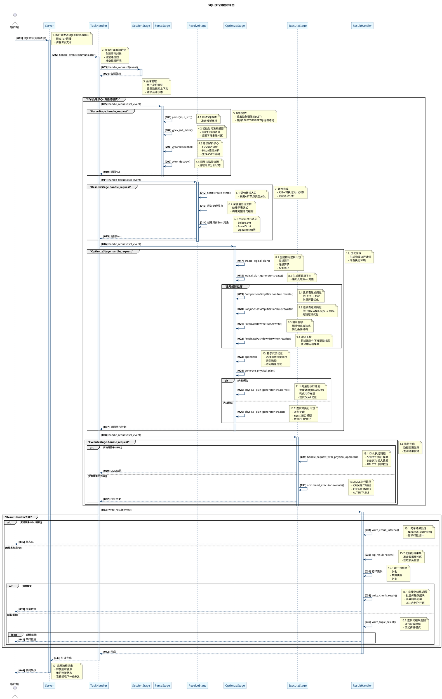

### SQL 执行流程时序图

*图：MiniOB SQL 执行流程时序图（可通过 PlantUML 源码重新生成）*

> 💡 提示：本图由 [PlantUML](https://www.plantuml.com/plantuml) 在线工具生成，可用于调试或更新图表。

---

#### PlantUML 源码

建议保存此代码以便后续修改图像内容：

```plantuml
@startuml
title SQL 执行流程时序图\n

skinparam sequence {
  ArrowColor #003366
  LifeLineBorderColor #003366
  LifeLineBackgroundColor #F0F8FF
  ParticipantBorderColor #003366
  ParticipantBackgroundColor #E6F7FF
  ParticipantFontColor #003366
  NoteBackgroundColor #FFF2E6
  NoteBorderColor #FFA940
  BoxPadding 20
}

actor 客户端 as Client
participant "Server" as Server
participant "TaskHandler" as TaskHandler
participant "SessionStage" as Session
participant "ParseStage" as Parser
participant "ResolveStage" as Resolver
participant "OptimizeStage" as Optimizer
participant "ExecuteStage" as Executor
participant "ResultHandler" as Result

autonumber "<b>[000]"

Client -> Server: SQL命令(网络请求)
note right: 1. 客户端发送SQL到服务器端口\n   - 建立TCP连接\n   - 传输SQL文本
activate Server

Server -> TaskHandler: handle_event(communicator)
activate TaskHandler
note right: 2. 任务处理器初始化\n   - 创建事件对象\n   - 绑定通信器\n   - 准备处理环境

TaskHandler -> Session: handle_request2(event)
activate Session
Session --> TaskHandler: 会话就绪
deactivate Session
note right Session: 3. 会话管理\n   - 用户身份验证\n   - 设置数据库上下文\n   - 维护会话状态

group "SQL处理核心 (责任链模式)"
  TaskHandler -> Parser: handle_request(sql_event)
  activate Parser
  group "ParseStage.handle_request"
    Parser -> Parser: parse(sql.c_str())
    note right: 4.1 启动SQL解析\n   - 准备解析环境
    Parser -> Parser: yylex_init_extra()
    note right: 4.2 初始化词法扫描器\n   - 分配扫描器资源\n   - 设置字符串缓冲区
    Parser -> Parser: yyparse(scanner)
    note right: 4.3 语法解析核心\n   - Flex词法分析\n   - Bison语法分析\n   - 生成AST节点树
    Parser -> Parser: yylex_destroy()
    note right: 4.4 释放扫描器资源\n   - 清理词法分析状态
    Parser --> TaskHandler: 返回AST
  end
  deactivate Parser
  note right: 5. 解析完成\n   - 输出抽象语法树(AST)\n   - 支持SELECT/INSERT等语句结构
  
  TaskHandler -> Resolver: handle_request(sql_event)
  activate Resolver
  group "ResolveStage.handle_request"
    Resolver -> Resolver: Stmt::create_stmt()
    note right: 6.1 语句转换入口\n   - 根据AST节点类型分发
    Resolver -> Resolver: 递归处理节点
    note right: 6.2 深度遍历语法树\n   - 处理子表达式\n   - 构建完整语句结构
    Resolver -> Resolver: 创建具体Stmt对象
    note right: 6.3 生成可执行语句\n   - SelectStmt\n   - InsertStmt\n   - UpdateStmt等
    Resolver --> TaskHandler: 返回Stmt
  end
  deactivate Resolver
  note right: 7. 转换完成\n   - AST→可执行Stmt对象\n   - 完成语义分析
  
  TaskHandler -> Optimizer: handle_request(sql_event)
  activate Optimizer
  group "OptimizeStage.handle_request"
    Optimizer -> Optimizer: create_logical_plan()
    note right: 8.1 创建初始逻辑计划\n   - 扫描算子\n   - 连接算子\n   - 投影算子
    Optimizer -> Optimizer: logical_plan_generator.create()
    note right: 8.2 生成逻辑算子树\n   - 递归处理Stmt对象
    
    group "重写规则应用"
      Optimizer -> Optimizer: ComparisonSimplificationRule.rewrite()
      note right: 9.1 比较表达式简化\n      例: 1=1 → true\n      常量折叠优化
      Optimizer -> Optimizer: ConjunctionSimplificationRule.rewrite()
      note right: 9.2 连接表达式简化\n      例: false AND expr → false\n      短路逻辑优化
      Optimizer -> Optimizer: PredicateRewriteRule.rewrite()
      note right: 9.3 谓词重写\n      删除恒真表达式\n      简化条件结构
      Optimizer -> Optimizer: PredicatePushdownRewriter.rewrite()
      note right: 9.4 谓词下推\n      将过滤条件下推至扫描层\n      减少中间结果集
    end
    
    Optimizer -> Optimizer: optimize()
    note right: 10. 基于代价优化\n   - 选择最优连接顺序\n   - 索引选择\n   - 访问路径优化
    
    Optimizer -> Optimizer: generate_physical_plan()
    alt 向量模型
      Optimizer -> Optimizer: physical_plan_generator.create_vec()
      note right: 11.1 向量化执行计划\n   - 批量处理(1024行/批)\n   - 列式内存布局\n   - 现代OLAP优化
    else 火山模型
      Optimizer -> Optimizer: physical_plan_generator.create()
      note right: 11.2 迭代式执行计划\n   - 逐行处理\n   - next()接口模型\n   - 传统OLTP优化
    end
    Optimizer --> TaskHandler: 返回执行计划
  end
  deactivate Optimizer
  note right: 12. 优化完成\n   - 生成物理执行计划\n   - 准备执行环境
  
  TaskHandler -> Executor: handle_request(sql_event)
  activate Executor
  group "ExecuteStage.handle_request"
    alt 有物理算子(DML)
      Executor -> Executor: handle_request_with_physical_operator()
      note right: 13.1 DML执行路径\n   - SELECT: 执行查询\n   - INSERT: 插入数据\n   - DELETE: 删除数据
      Executor --> TaskHandler: DML结果
    else 无物理算子(DDL)
      Executor -> Executor: command_executor.execute()
      note right: 13.2 DDL执行路径\n   - CREATE TABLE\n   - CREATE INDEX\n   - ALTER TABLE
      Executor --> TaskHandler: DDL结果
    end
  end
  deactivate Executor
  note right: 14. 执行完成\n   - 数据变更生效\n   - 查询结果就绪
end

TaskHandler -> Result: write_result(event)
activate Result

group "ResultHandler处理"
  alt 无结果集(DDL/更新)
    Result -> Result: write_result_internal()
    note right: 15.1 简单结果处理\n   - 操作状态(成功/失败)\n   - 影响行数统计
    Result --> Client: 状态码
  else 有结果集(查询)
    Result -> Result: sql_result->open()
    note right: 15.2 初始化结果集\n   - 准备数据缓冲区\n   - 获取表头信息
    Result -> Result: 打印表头
    note right: 15.3 输出列信息\n   - 列名\n   - 数据类型\n   - 列宽
    
    alt 向量模型
      Result -> Result: write_chunk_result()
      note right: 16.1 向量化结果返回\n   - 批量传输数据块\n   - 高效网络利用\n   - 减少序列化开销
      Result --> Client: 批量数据
    else 火山模型
      Result -> Result: write_tuple_result()
      note right: 16.2 迭代式结果返回\n   - 逐行获取数据\n   - 流式传输模式
      loop 逐行处理
        Result --> Client: 单行数据
      end
    end
  end
end

Result --> TaskHandler: 完成
deactivate Result

TaskHandler --> Server: 处理完成
deactivate TaskHandler

Server --> Client: 最终确认
deactivate Server
note right: 17. 完整流程结束\n   - 释放所有资源\n   - 维护连接状态\n   - 准备接收下一条SQL

@enduml
```