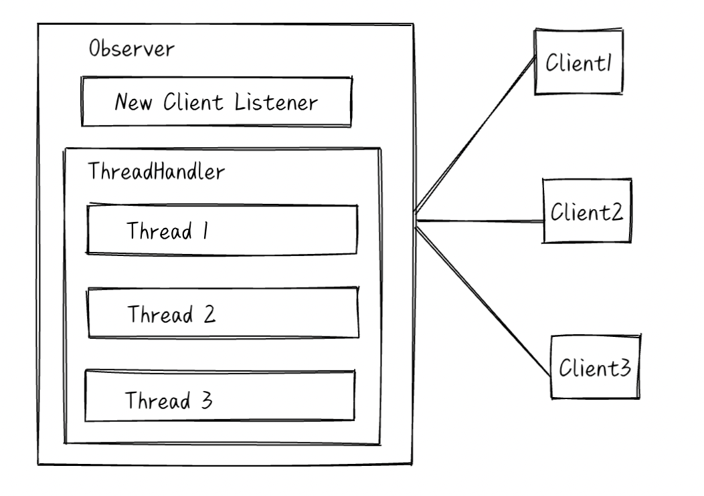

# 线程模型

> 本篇文档介绍 MiniOB 中的线程池模型。

## 简介
多线程是提高系统资源利用率的一种常用手段，也是我们学习软件开发进阶的必经之路。
MiniOB 实现了一个可扩展的线程模型，当前支持两种线程池模型：

- 一个连接一个线程；

- 一个线程池处理所有连接。

> 这种设计是模仿了MySQL/MariaDB的线程模型设计。

## 线程模型设计

### 命令行参数
当前MiniOB的线程池模型通过命令行接口指定使用哪种类型：
```bash
# 一个连接一个线程（默认）
observer -T=one-thread-per-connection
# 一个线程池处理所有连接
observer -T=java-thread-pool
```

ThreadHandler::create 会根据传入的名字创建对应的 ThreadHandler 对象。

### 线程池模型做什么
这个模型并不负责所有的任务，只处理客户端发来的请求。包括监听客户端是否有消息到达、处理SQL请求与返回应答、关闭连接等。

线程模型并不负责监听新的客户端连接，这是在主线程中做的事情，参考 `NetServer::serve`。当有新的连接到达时，会调用 `ThreadHandler::new_connection`，线程模型按照自己的模型设计来处理新来的连接。

### 一个连接一个线程
OneThreadPerConnectionThreadHandler 会为每个连接创建一个线程，这个线程负责监听这个连接是否有消息到达、处理SQL请求与返回应答、关闭连接等。



### 线程池模型
JavaThreadPoolThreadHandler 会创建一个线程池，线程池中一个线程负责监听所有连接是否有消息到达。如果有消息到达，就将这个连接对象放入线程池任务队列中，等待线程池中的线程来处理。在某个连接的任务处理完成之前，不会监听它的新消息。

这个线程池使用libevent实现消息监听，参考 `JavaThreadPoolThreadHandler::start`。

这里解释一下为什么叫做JavaThreadPoolThreadHandler，因为这个线程池的设计是参考了Java的线程池设计，但是做了简化，参考 `ThreadPoolExecutor`。

ThreadPoolExecutor 是一个简单的可伸缩线程池。当任务比当前空闲线程多的时候，就会扩容。当某些线程空闲时间比较久，就会自动退出。


## 参考
- [MySQL Percona Thread Pool](https://docs.percona.com/percona-server/5.7/performance/threadpool.html#handling-of-long-network-waits)
- [MariaDB Thread Pool](https://mariadb.com/kb/en/thread-groups-in-the-unix-implementation-of-the-thread-pool/)
- [Java ThreadPoolExecutor](https://docs.oracle.com/javase/8/docs/api/java/util/concurrent/ThreadPoolExecutor.html)