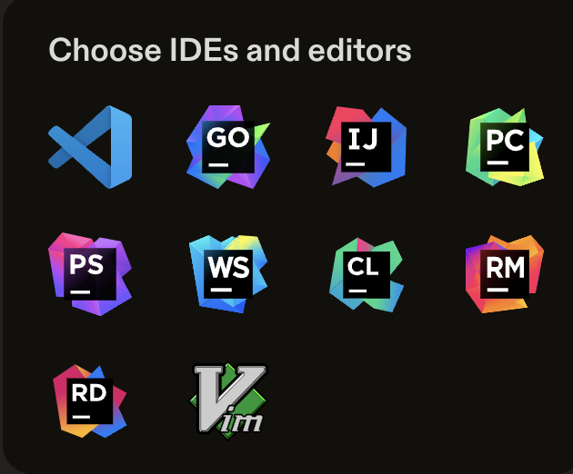
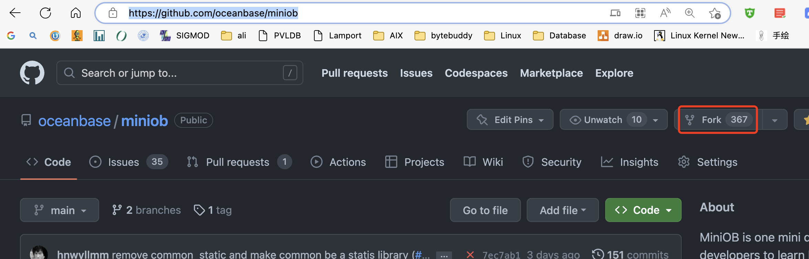
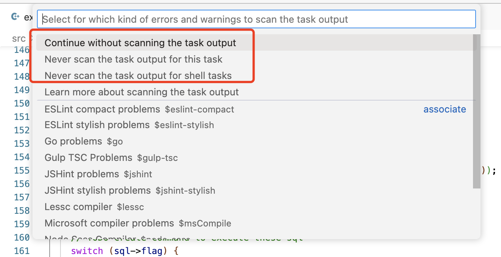
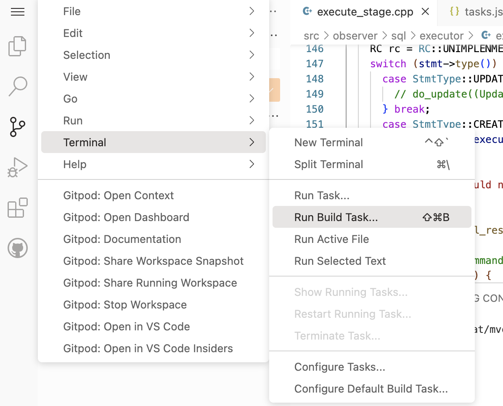
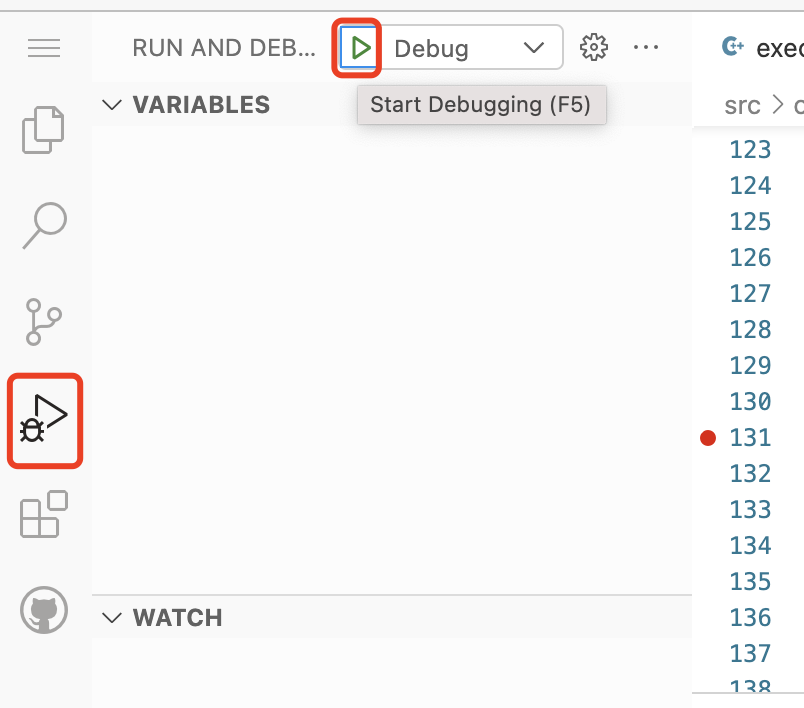
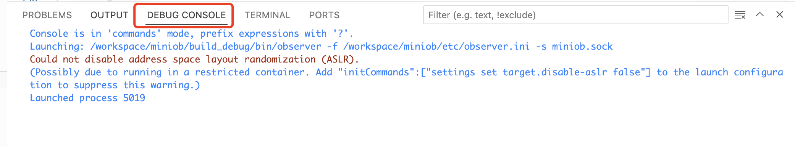
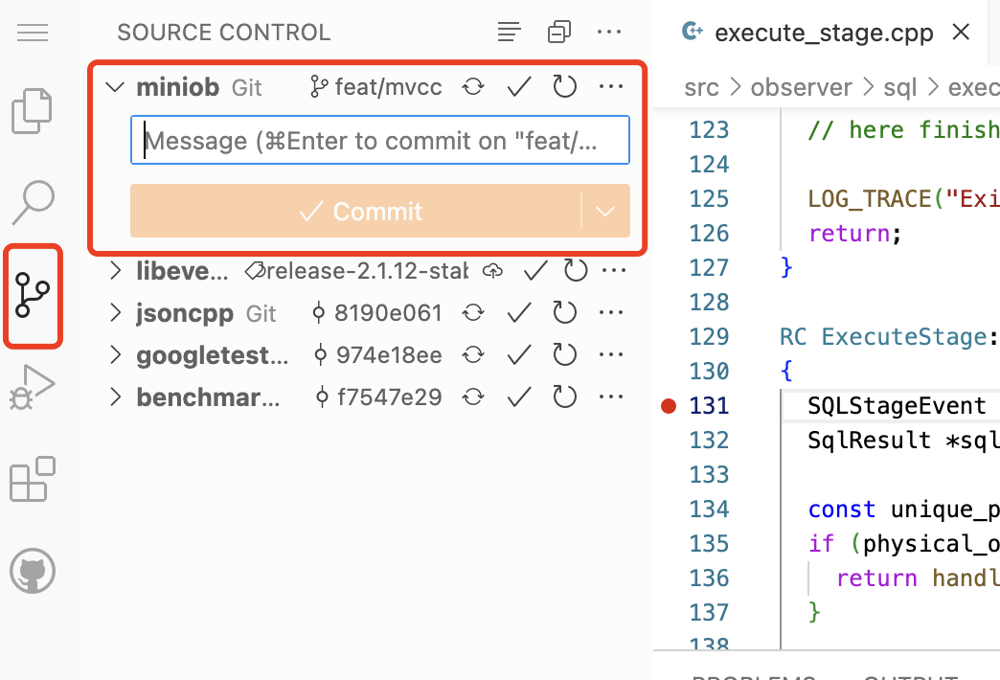
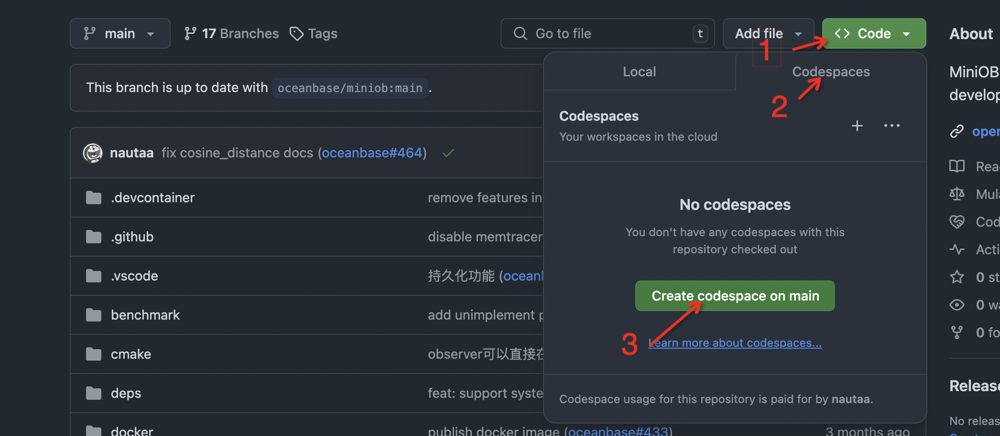

# 使用在线开发环境开发 MiniOB

本篇文章介绍如何使用 [GitPod](https://www.gitpod.io/) 或 [GitHub Codespaces](https://github.com/features/codespaces)开发 [MiniOB](https://github.com/oceanbase/miniob)。对于代码开发调试，可以参考[使用 vscode 开发 miniob](./how_to_dev_miniob_by_vscode.md), [MiniOB 调试](./miniob-how-to-debug.md) 。

## GitPod 开发环境
### GitPod 简介
[GitPod](https://www.gitpod.io/) 是一个能让我们在任何地方都能方便开发自己代码的云平台。在开发时，GitPod会提供一个虚拟机一样的开发环境，开发平台是Linux，并且GitPod可以直接打开GitHub项目，支持很多IDE，比如Visual Studio Code、Clion、VIM等。

本篇文章将介绍如何在GitPod上使用Visual Studio Code（浏览器版）来开发MiniOB。

注意: GitPod 可能需要[手机号验证](https://github.com/gitpod-io/gitpod/issues/11339)，如果无法通过验证，可以尝试其他开发环境。

### 在 GitPod 上开发自己的 MiniOB

#### 创建自己的GitHub项目

在开发MiniOB之前，应该先在GitHub上将MiniOB放在自己的私有仓库中。为了方便演示，我这里直接使用fork的方式，在自己的个人仓库中创建一个共有(public)仓库。

在浏览器中打开 [MiniOB](https://github.com/oceanbase/miniob) 然后fork仓库

  fork后就会在自己的个人名下有一个miniob仓库代码

  

#### 在 GitPod 上打开自己的项目

使用 [GitPod](https://www.gitpod.io/) 打开自己的项目

> 如果是第一次使用，需要输入一些额外的信息，按照GitPod的引导来走就行，最终会引导你打开你的项目。

  

  

  这里选择自己的代码项目，并且使用vscode浏览器版本，容器规格也选择最小的（最小的规格对miniob来说已经非常充足）
  

  

  

如果以前已经操作过上面的步骤，可以直接从gitpod的首页找到自己的项目。

#### 代码构建

**环境初始化**
因为MiniOB当前已经将.vscode文件加入到项目中，所以可以直接使用当前已有的一些命令(task)来构建代码。
如果是一个全新的机器环境，那么先要运行 `init` 任务。init 任务会在当前的机器上安装一些依赖，比如 google test、libevent等。

> NOTE: gitpod 项目启动时，就会自动运行初始化。如果没有运行，可以手动执行一下。可以参考 .gitpod.yml 文件

**编译miniob**
初始化完成，可以运行 `Build` 任务，即可构建。

这些构建方法，也可以通过命令行的方式手动执行。

所有的任务都可以从这里找到入口。

运行 init 命令的入口。

运行构建（编译）的入口。需要设置默认构建的任务，vscode才能运行。这里已经设置过了。

构建（编译）时，会有一些输出，如果有编译错误，也可以直接使用鼠标点击跳转到错误的地方。

还可以构建其它模式。

> WARNING: 不要在gitpod的终端上，执行 sh build.sh，而是执行 bash build.sh 或者直接运行 ./build.sh

miniob 虽然是cmake功能，可以使用vscode带的cmake配置，但是miniob在编译时，会使用一些变量来控制编译什么版本，比如是否编译UNITTEST，是否开启ASAN等。因此这里使用build.sh脚本来简化项目的编译命令。

#### 代码调试
与代码构建类似，MiniOB 可以支持在vscode中直接启动调试程序。启动的调试程序为默认构建项目，当前是 debug 模式编译的miniob。
与普通的调试类似，可以自行设置断点。断点可以在运行程序之前也可以在其后。
启动调试服务端后，打开一个新的终端，来运行客户端，以便向服务端发起命令。

**下断点**

光标放到某一行，vscode编辑框的左边就会出现一个粉红色的圆点，点击圆点就可以下断点

圆点变成红色，断点下成功了。

**启动调试**

vscode 为调试进程也创建了一个终端，可以在这里看到observer运行期间在控制台上的输出。

调试时显示的界面。可以看到最上面中央处，有一个调试的界面，可以执行单步调试，或者跳转到函数内。这与普通的调试器界面类似。左边有一些变量的展示。

另外，我这里开了一个终端，运行客户端连接服务端发起命令请求。

#### 代码提交
作为一个GitHub项目，一个功能或者BUG开发完成后，需要将代码推送到远程仓库。vscode已经集成了GitHub和git插件，可以方便的进行操作。

完成一个功能，就提交一次。这里输入commit message后直接提交即可。

注意这里仅仅提交到了本地，如果要提交到GitHub（远程仓库），需要执行”推送“，即 git push。

Git的其它操作链接在这里

如果推送时出现这样的错误，可能是没有权限。gitpod 会自动提示然后跳转过去设置权限即可。

我这里就是没有写权限，所以无法推送到远程仓库。

## GitHub Codespaces 开发环境
GitHub Codespaces 是托管在云中的开发环境。它允许开发⼈员通过浏览器或从本地的 Visual Studio Code IDE 直接进⾏调试 GitHub 上的代码。GitHub Codespaces 的使用十分方便，但是实际使用体验受限于网络环境，适合网络环境比较好的开发者使用。

### 在 GitHub Codespaces 上开发自己的 MiniOB

#### 创建自己的GitHub项目

在开发 MiniOB 之前，应该先在 GitHub 上将 MiniOB 放在自己的私有仓库中。具体方法可以参考: [创建 Github 私有仓库](../game/github-introduction.md#github-私有仓库创建)

#### 在 GitHub Codespaces 上打开自己的项目

在浏览器中打开自己的私有仓库，依次点击截图中的 `Code` -> `Codespaces` -> `Create codespace on main`，即可初始化一个 MiniOB 在线开发环境。

#### 代码调试
在GitHub Codespaces 上开发调试 MiniOB 与本地环境基本类似，这里不再重复。可以参考：对于代码开发调试，可以参考[使用 vscode 开发 miniob](./how_to_dev_miniob_by_vscode.md), [MiniOB 调试](./miniob-how-to-debug.md) 。

