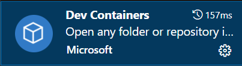
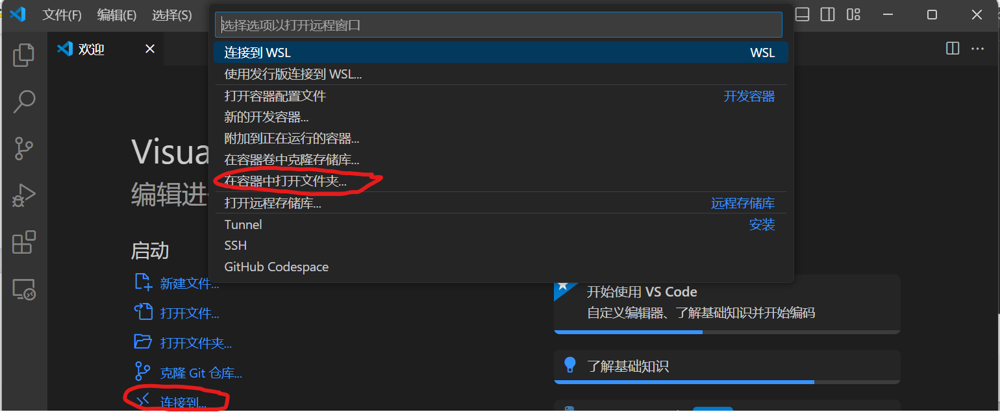
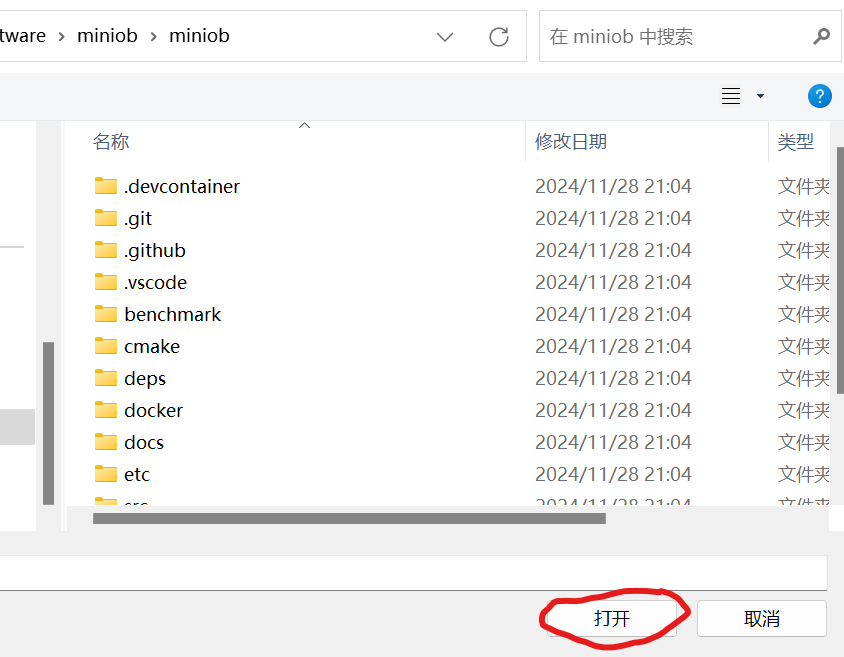
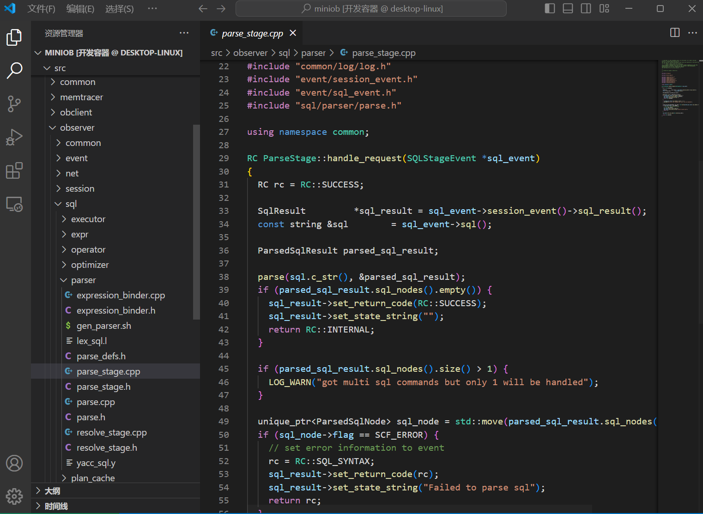
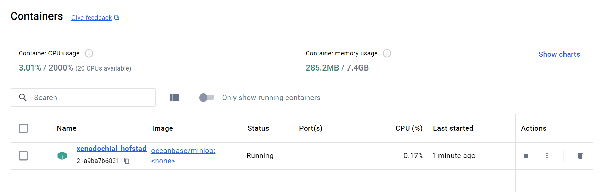
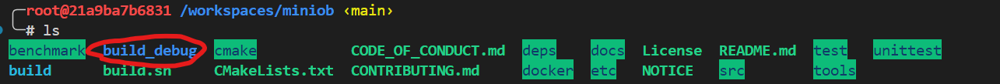
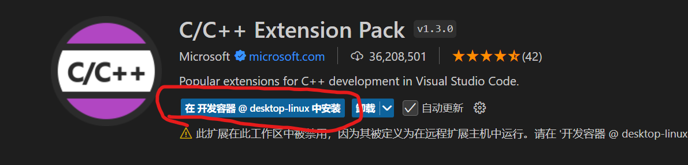
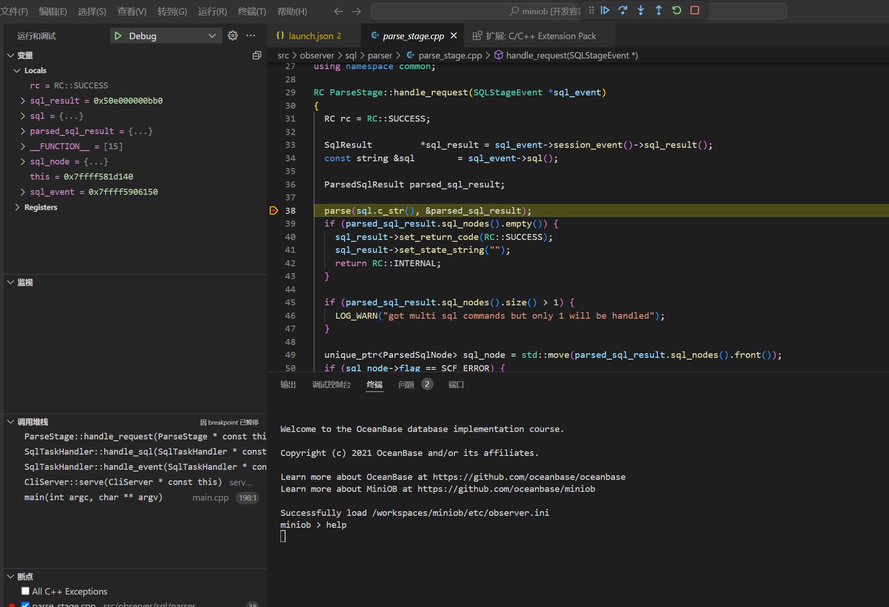

# 在windows上通过docker配置环境并利用vscode编辑、开发、调试代码（简易版）

# 步骤：
## 1.下载docker

[Get Started | Docker](https://www.docker.com/get-started/)

## 2.获取oceanbase/miniob的docker环境

在任意位置启动 终端(cmd或者powershell)，运行以下代码：

```bash
# 下面的命令三选一即可
docker pull oceanbase/miniob         # pull from docker hub
docker pull ghcr.io/oceanbase/miniob && docker tag ghcr.io/oceanbase/miniob oceanbase/miniob # pull from github
docker pull quay.io/oceanbase/miniob && docker tag quay.io/oceanbase/miniob oceanbase/miniob # pull from github # pull from quay.io
```

## 3.在本地克隆miniob代码

在本地新建一个空的文件夹，打开该文件夹右键在终端打开，输入以下命令克隆miniob：
```bash
git clone https://github.com/oceanbase/miniob.git
```

若输出以下信息代表克隆成功（对克隆成功的判定标准详情可见下面文章的第3步第2小点）
[在windows上通过docker配置环境并利用vscode调试代码（手把手版）](./how_to_dev_in_docker_container_by_vscode_on_windows.md)

## 4.在VSCode中利用dev containers插件实现在docker容器环境下打开miniob源代码
### 1）准备工作：需要有vscode和git
（如果没有，请参照下面文章的第3步第1小点安装）
[在windows上通过docker配置环境并利用vscode调试代码（手把手版）](./how_to_dev_in_docker_container_by_vscode_on_windows.md)

### 2）在应用商店中搜索以下插件并安装

### 3）利用该插件轻松实现环境配置
第一步，在vscode初始界面选择“连接到”，会看到上方搜索栏弹出列表
第二步，在弹出的列表中选择“在容器中打开文件夹”
第三步，选择打开你克隆得到的miniob文件夹（注意不是你自己创建的空文件夹）


打开完成后进入以下界面，源代码已成功在vscode中，在docker容器的环境下打开


此时docker desktop软件显示你利用dev container自动创建的容器


## 5.运行源代码并演示可以调试

### 1）编译源代码
vscode的菜单栏中选择终端->新建终端，在终端中编译源代码，详情请见以下文件：
[如何编译miniob](.././how_to_build.md)

编译完出现build_debug文件


### 2）演示使用vscode中的调试工具

在调试之前，需要在这个docker容器的环境下安装c/c++ extension pack拓展，点击“在开发容器中安装”：


安装完成后，点击“运行”->“启动调试”之后就可以进行调试了，以下是个到断点处中断的事例


到此，环境配置全部完成，利用dev-containers插件简化了整个配置环境的过程。