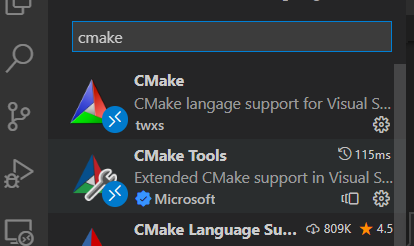

# 环境准备
## 运行环境
* 操作系统

```bash
frank@DESKTOP-6NF3B9K:~/git/miniob$ cat /etc/os-release
NAME="Ubuntu"
VERSION="20.04.5 LTS (Focal Fossa)"
ID=ubuntu
ID_LIKE=debian
PRETTY_NAME="Ubuntu 20.04.5 LTS"
VERSION_ID="20.04"
HOME_URL="https://www.ubuntu.com/"
SUPPORT_URL="https://help.ubuntu.com/"
BUG_REPORT_URL="https://bugs.launchpad.net/ubuntu/"
PRIVACY_POLICY_URL="https://www.ubuntu.com/legal/terms-and-policies/privacy-policy"
VERSION_CODENAME=focal
UBUNTU_CODENAME=focal
```
注：这里直接用的windows的WSL，

## 软件要求
1. vscode
2. cmake
3. make
4. gcc/g++
5. libevent
6. googletest
7. jsoncpp
8. git

## 获取代码
```bash
git clone https://github.com/oceanbase/miniob.git
```
## 安装软件
可以参考miniob/docs/how\_to\_build.md。


# vscode配置
使用vscode打开miniob工程目录。

```bash
cd miniob
code .
```
## 安装插件
||<br>|
| ----- | ----- |

## 配置编译tasks.json
> 在工程的.vscode目录下新建tasks.json

```json
{
    "options": {
        "cwd": "${workspaceFolder}/build"
    },
    "tasks": [
        {
            "label": "cmake",
            "command": "cmake",
            "args": [
                "-DDEBUG=ON",
                ".."
            ]
        },
        {
            "label": "make",
            "command": "make"
        },
        {
            "label": "CMake Build",
            "dependsOn": [
                "cmake",
                "make"
            ]
        }
    ],
    "version": "2.0.0"
}
```
注意：

* options：cmake临时文件的目录
* args：cmake需要的参数

## 配置调试launch.json
> 在工程的.vscode目录下新建launch.json

```json
{
    // 使用 IntelliSense 了解相关属性。 
    // 悬停以查看现有属性的描述。
    // 欲了解更多信息，请访问: https://go.microsoft.com/fwlink/?linkid=830387
    "version": "0.2.0",
    "configurations": [
        {
            "name": "(gdb) 启动",
            "type": "cppdbg",
            "request": "launch",
            "program": "${workspaceFolder}/build/bin/observer",
            "args": ["-f", "../../etc/observer.ini"],
            "stopAtEntry": false,
            "cwd": "${fileDirname}",
            "environment": [],
            "externalConsole": false,
            "MIMode": "gdb",
            "setupCommands": [
                {
                    "description": "为 gdb 启用整齐打印",
                    "text": "-enable-pretty-printing",
                    "ignoreFailures": true
                },
                {
                    "description":  "将反汇编风格设置为 Intel",
                    "text": "-gdb-set disassembly-flavor intel",
                    "ignoreFailures": true
                }
            ],
            "preLaunchTask": "CMake Build"
        }
    ]
}
```
注意：

* program：编译出来的可执行文件
* args：运行参数
* preLaunchTask：`"label": "CMake Build"` 对应


# 演示
* 重新使用vscode打开，打开后会自动运行tasks的cmake。


* 设置断点、启动调试


注意：启动是会触发make，对工程进行编译。因为是单线程编译，所以第一次惦记启动gdb时需要时间较长，后续如果没有修改源码的操作，则直接踢动gdb进行调试。如果想使用多线程编译可以在tasks.json中配置make参数。

```json
        {
            "label": "make",
            "command": "make",
            "args": [
                "-j",
                "4"
            ]
        },
```
args中配置相当于make -j 4

终端输出如下：


* 调试


注意：同种标记部分包括调试常用的功能，如：查看变量、调用栈、断点，以及n, s, finish, r等命令。
