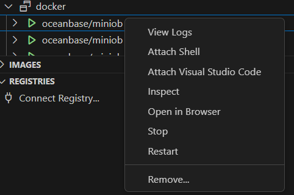
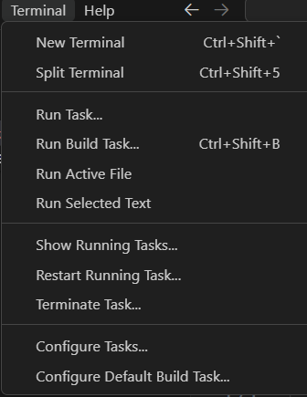
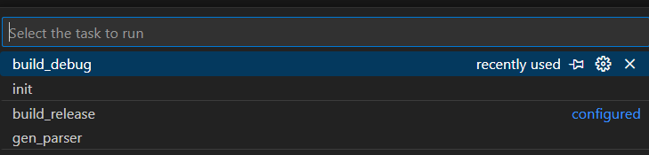
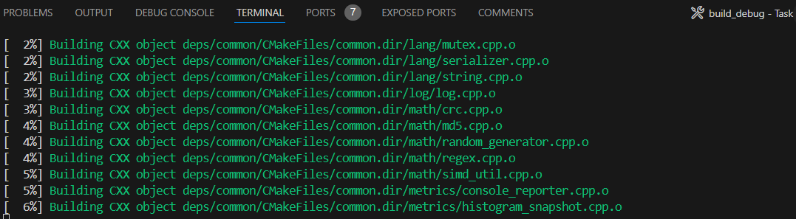
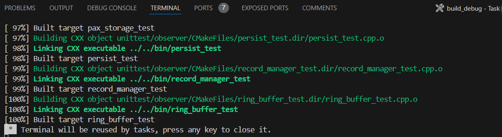
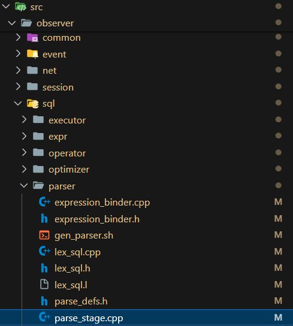
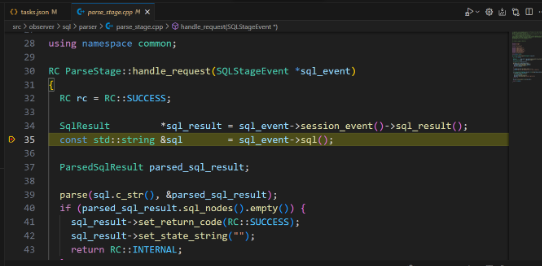
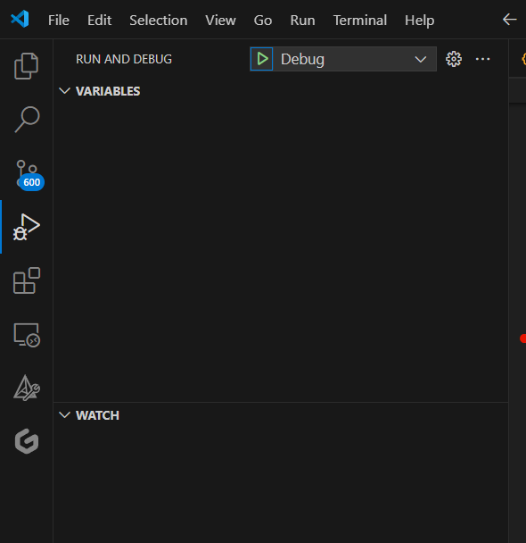
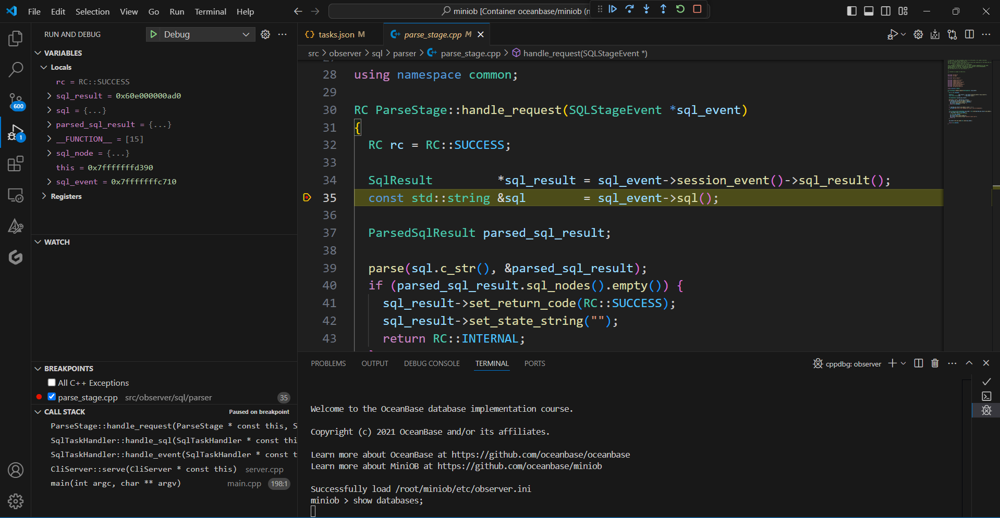

# 基于Windows+docker容器在本地利用VSCode编辑、开发及调试miniob
## 安装Docker
## clone miniob 
## 将clone到的文件映射到docker容器内部
以上三个部分参考本仓库文档 [在windows上通过docker配置环境并利用vscode调试代码（手把手版）](https://oceanbase.github.io/miniob/dev-env/how_to_dev_in_docker_container_by_vscode_on_windows/)
。
## 在vscode中启动docker
在侧边栏找到docker插件，点击

选择Attach Visual Studio Code,之后一个新的vscode会弹出

## 编译工程代码
在顶部菜单选择Terminal->Run Task

选择build-debug

底部终端会显示进度，到100%即为成功

## 在VSCode中调试miniob
（这里仅测试是否可以进行调试）

进入src->observer->sql->parser->parser_stage.app

加入断点

在侧边栏Run and Debug中进行Debug

代码在断点处停下

