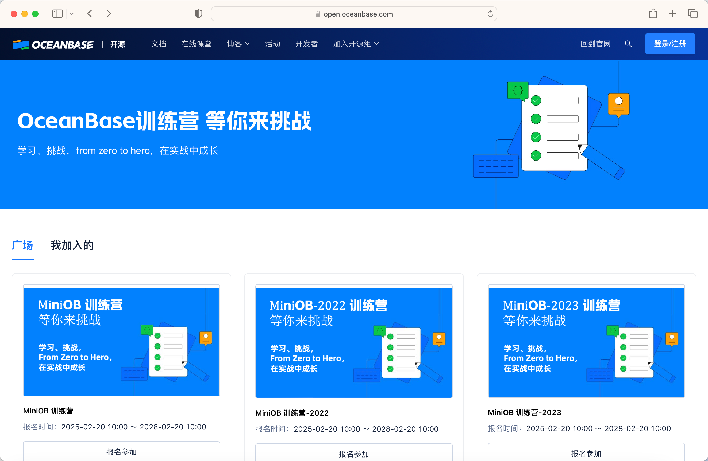
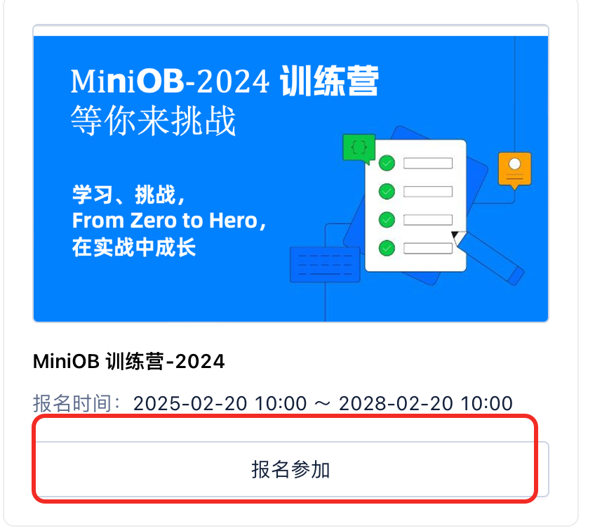
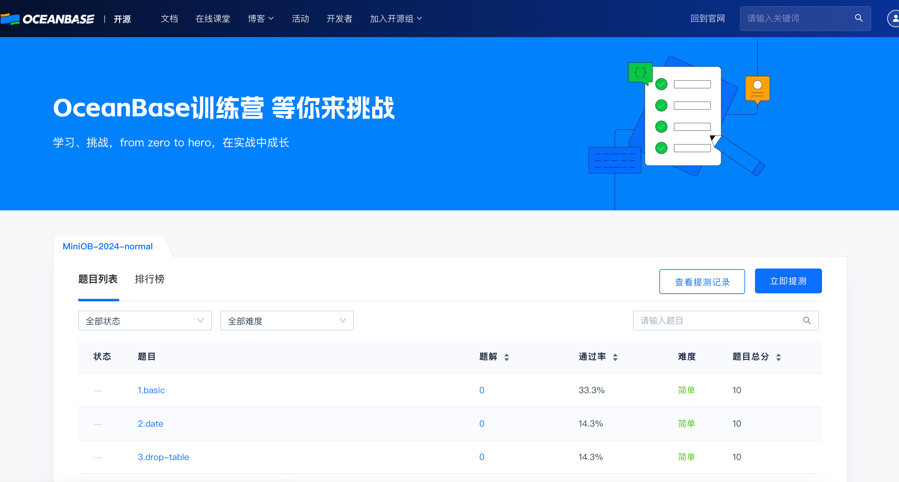
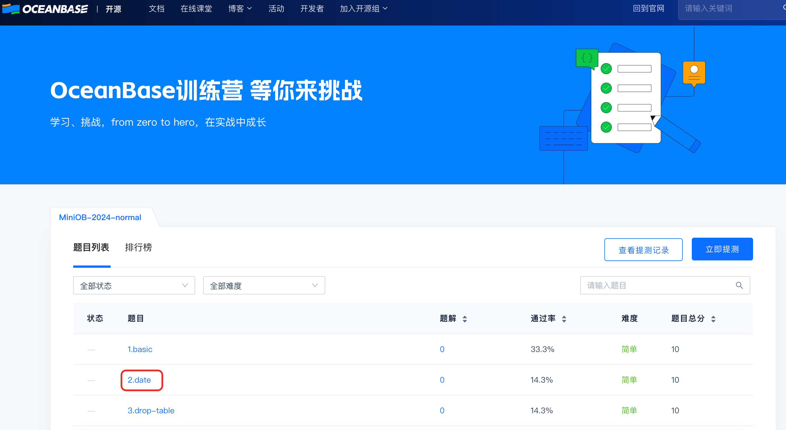
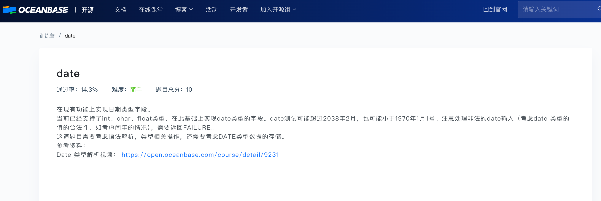
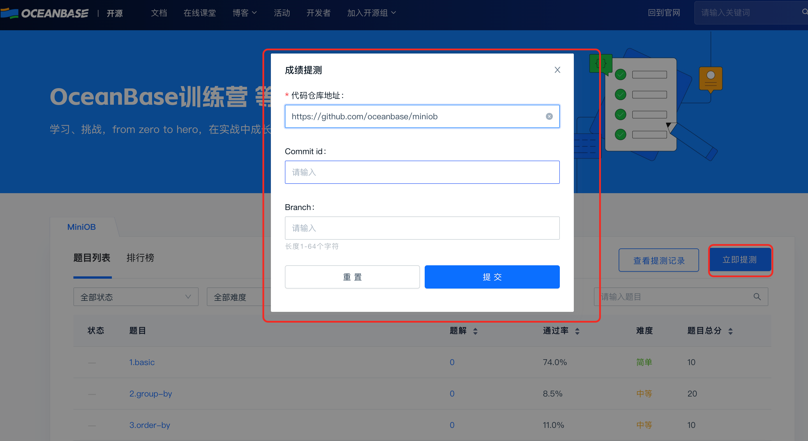
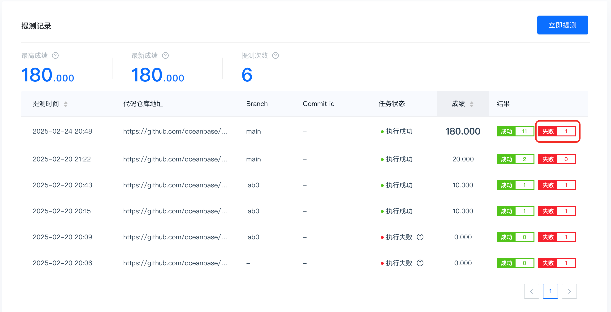

# 训练营平台使用说明

[训练营平台](https://open.oceanbase.com/train) 是 OceanBase 为学生和数据库开发者设计的数据库学习与练习平台，旨在帮助用户更高效地掌握数据库基础知识。通过该平台，开发者可以从零开始逐步理解数据库的底层原理和实现方式，参与数据库实践与开发练习。训练营平台支持为 MiniOB/OceanBase 代码提交测试，通过运行自动化测试用例，反馈用户提交代码的运行结果和问题。

## 如何使用训练营提交代码测试

用户可根据下面的流程进行提测。

### 1. 进入训练营平台并登陆训练营平台

打开训练营网站：https://open.oceanbase.com/train

你会看到训练营主页。

点击训练营主页上方的登陆/注册按钮登陆训练营平台。

### 2. 报名具体的训练营课题进行提测

登陆后再点击 `广场` 中的训练营课题的 `报名参加` 按钮报名具体的训练营课题。目前公开的训练营课题包含 `MiniOB` 对应 2021 年大赛题目；`MiniOB 2022` 对应 2022 年大赛题目；`MiniOB 2023` 对应 2023 年大赛题目；`MiniOB 2024` 对应 2024 年大赛题目。后续会增加更多的训练营课题。

对于不需要报名的训练营课题，在点击 `报名参加` 后，会自动跳转到训练营课题的题目页面。
对于需要报名的训练营课题，需要在点击 `报名参加` 后，填写自己的报名信息，再进入训练营课题的题目页面。（**注意**：如果找不到自己已报名的训练营课题，可以点击 `我加入的` 页面进行查看。）

### 3. 查看训练营课题的具体题目

进入到训练营课题你会看到如下页面。用户可以在题目列表查看该训练营课题对应的所有题目。如果要查看此题目排行榜，可点击「排行榜」按钮，目前只显示前 10 名及个人成绩，根据总分降序排列。

通过点击题目可以查看题目的详细描述，请参考题目的详细描述进行代码编写，和自测。

### 4. 提交代码测试
在完成本地代码编写和自测后，请将代码提交到 Github/Gitee 仓库中。
代码提交方法请参考[Github 代码提交](https://oceanbase.github.io/miniob/game/github-introduction/)，[Gitee 代码提交](https://oceanbase.github.io/miniob/game/gitee-instructions/)。

点击「立即提测」按钮后，会弹出代码提交窗口。请填写仓库地址，commit id 和 branch 等必要信息并点击提交按钮。

### 5. 查看提测结果
提交代码后，训练营平台会运行自动化测试用例，并反馈用户提交代码的运行结果和问题（如果等待时间过长(miniob 相关课题等待超过 1 小时，oceanbase 相关题目超过 6 小时)可联系相关工作人员）。

可以点击 「查看提测记录」按钮查看提测结果。对于失败的测试用例，请点击下图中的按钮，即可查看失败的详细原因。

如果在使用训练营平台的过程中有问题可以在 https://ask.oceanbase.com/ 提问，问题分类请选择 "训练营"。

