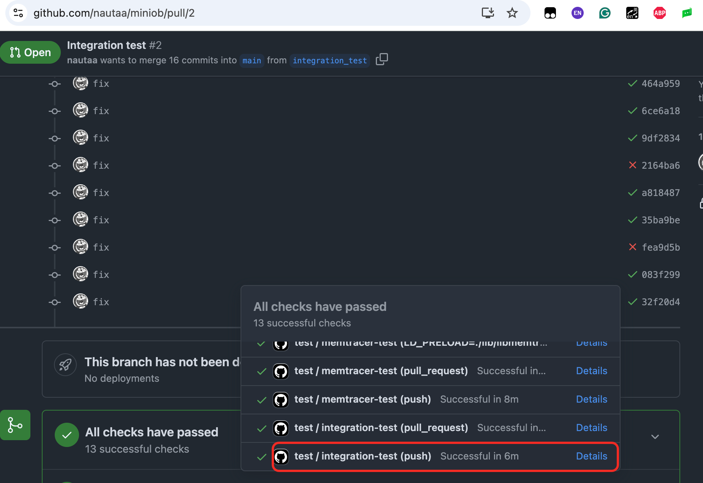

# MiniOB 集成测试使用文档
MiniOB 集成测试的代码位于: `test/integration_test` 下，[训练营](http://open.oceanbase.com/train/) 中的测试与该集成测试基本一致。因此，大家可以通过该集成测试快速测试自己的 MiniOB 实现，自助排查训练营中未通过的测试用例。

# 如何运行集成测试

## 本地运行

### 前置依赖
1. 建议使用 MiniOB 提供的官方镜像进行开发，关于如何使用可参考：[开发环境](./introduction.md)
2. 安装集成测试运行所需依赖
```bash
sudo bash build.sh init
sudo apt -y install pip python3-pymysql python3-psutil mysql-server
```

### 执行集成测试
```
cd test/integration_test
bash ./miniob_test_docker_entry.sh
python3 libminiob_test.py -c conf.ini
```
## GitHub 中运行

目前，当你在 GitHub 上提交代码时，并向 main 分支提交 Pull Request 时，会自动触发测试用例的运行。你可以在 Pull Request 界面查看集成测试的运行结果。


关于如何使用 Github Action 以自定义集成测试的执行方式可以参考：[Github Action](https://docs.github.com/en/actions)

## 查看执行结果
当执行完一次集成测试后，最后的一条执行日志会展示执行结果，示例如下：

```
2025-04-22 16:52:55.849 [INFO ] >>> miniob test done. result=case:aggregation-func, passed: False, result_groups:[{name:init data},{name:count, results:SELECT count(*) FROM aggregation_func;
- 4}],case:basic, passed: True, result_groups:[{name:create table},{name:init data},{name:basic delete},{name:basic select},{name:create index}],case:date, passed: False, result_groups:[{name:init data, results:CREATE TABLE date_table(id int, u_date date);
- SUCCESS
+ SQL_SYNTAX > Failed to parse sql}],case:drop-table, passed: False, result_groups:[{name:drop empty table, results:create table Drop_table_1(id int);
drop table Drop_table_1;
- SUCCESS
+ FAILURE}],case:update, passed: False, result_groups:[{name:init data},{name:update one row, results:UPDATE Update_table_1 SET t_name='N01' WHERE id=1;
- SUCCESS
+ FAILURE}] <<< libminiob_test [_test@libminiob_test.py:165] [MainThread] P:20180 T:139725989607232
2025-04-22 16:52:55.849 [INFO ] >>> result = rc=0:success,outputs=,errors=,body=task_id=default,return_code=0,
               branch=main,commit_id=,
               message=,case_result=case:aggregation-func, passed: False, result_groups:[{name:init data},{name:count, results:SELECT count(*) FROM aggregation_func;
- 4}],case:basic, passed: True, result_groups:[{name:create table},{name:init data},{name:basic delete},{name:basic select},{name:create index}],case:date, passed: False, result_groups:[{name:init data, results:CREATE TABLE date_table(id int, u_date date);
- SUCCESS
+ SQL_SYNTAX > Failed to parse sql}],case:drop-table, passed: False, result_groups:[{name:drop empty table, results:create table Drop_table_1(id int);
drop table Drop_table_1;
- SUCCESS
+ FAILURE}],case:update, passed: False, result_groups:[{name:init data},{name:update one row, results:UPDATE Update_table_1 SET t_name='N01' WHERE id=1;
- SUCCESS
+ FAILURE}]
             <<< libminiob_test [<module>@libminiob_test.py:317] [MainThread] P:20180 T:139725989607232
```

其中，`case:` 后面为测试用例名称，`passed:` 后面为该用例是否通过，`result_groups:` 后面为每个测试步骤的执行结果。对于未通过的测试用例，会在其`result_groups` 中展示失败的原因。例如对于上述示例中的 drop_table，其失败的原因为：

```
result_groups:[{name:drop empty table, results:create table Drop_table_1(id int);
drop table Drop_table_1;
- SUCCESS
+ FAILURE}]
```
其中， `-` 符号之后的为预期输出，`+` 符号之后的为你实现的 MiniOB 的实际输出。

# 如何添加集成测试测试用例
添加测试用例请参考：`test/integration_test/test_cases/MiniOB/python/` 中相关的测试用例，目前已公开几道简单题目（basic/drop_table/update等）的测试用例，帮助同学们快速入门。

下面通过一个示例来介绍如何添加一个测试用例（MiniOB 运行结果与 MySQL 运行结果对比）。

```python
def create_test_cases() -> TestCase:
  # 创建一个测试用例
  aggregation_test = TestCase()
  # 设置测试用例名称
  aggregation_test.name = 'aggregation-func'

  # 创建一个执行组
  init_group = aggregation_test.add_execution_group('init data')
  # 执行组中添加 DDL 语句，注意这里需要使用 add_runtime_ddl_instruction 方法，才会增加与 MySQL 对比的测试用例。
  init_group.add_runtime_ddl_instruction('CREATE TABLE aggregation_func(id int, num int, price float, addr char(4));')
  
  # 执行组中添加 DML 语句
  insert_sqls = [
    "INSERT INTO aggregation_func VALUES (1, 18, 10.0, 'abc');",
    "INSERT INTO aggregation_func VALUES (2, 15, 20.0, 'abc');",
    "INSERT INTO aggregation_func VALUES (3, 12, 30.0, 'def');",
    "INSERT INTO aggregation_func VALUES (4, 15, 30.0, 'dei');"
  ]
  for sql in insert_sqls:
    init_group.add_runtime_dml_instruction(sql)
  
  # 创建一个执行组，该执行组依赖于 init_group，通过定义依赖关系，可以在测试用例执行失败时，展示依赖的group 的测试用例，方便定位问题。
  count_group = aggregation_test.add_execution_group('count', [init_group])

  # 执行组中添加 DQL 语句，注意这里需要使用 add_runtime_dql_instruction 方法，才会增加与 MySQL 对比的测试用例。
  count_sqls = [
    'SELECT count(*) FROM aggregation_func;',
    'SELECT count(num) FROM aggregation_func;'
  ]

  for sql in count_sqls:
    count_group.add_runtime_dql_instruction(sql)

  return aggregation_test
```

# 常见问题

Q: 我在本地运行的集成测试和训练营中的测试是完全一样的吗还是有什么区别？
A: 可以认为是基本一样的，区别在于训练营中的集成测试是在内存受限（1GB）的容器内运行的。测试运行的代码基本一致，如果遇到在本地/Github 上运行的结果与训练营的结果不一致，欢迎反馈。

Q: 我用该集成测试可以复现出训练营中的问题，但是不知道如何进一步定位问题？
A: 你可以在集成测试的关键位置增加更多自定义的日志输出。默认情况下，集成测试的日志会输出到标准输出.