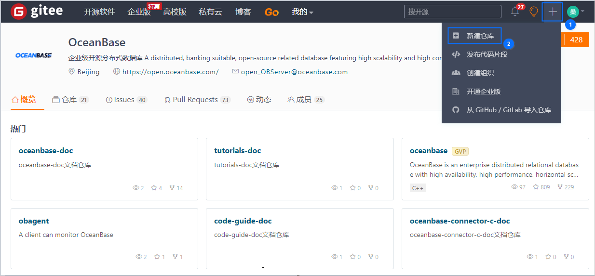
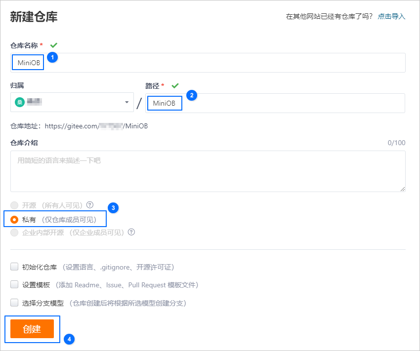
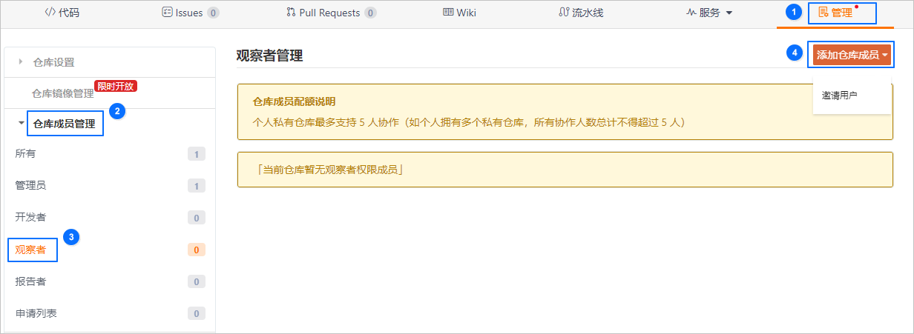
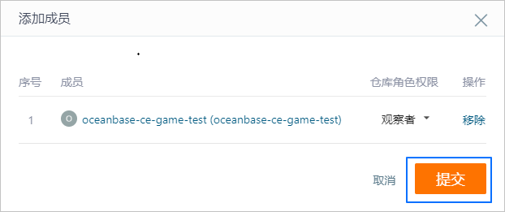

# MiniOB Gitee 在训练营中的使用说明

实战 MiniOB 编程需要在 Gitee 上创建自己的 private 仓库，在开发完成后，将代码提交到自己的仓库中，然后在训练营中进行测试。

MiniOB 仓库地址：<https://github.com/oceanbase/miniob>

训练营地址：<https://open.oceanbase.com/train>

本文将以 Gitee 为例介绍如何在训练营中进行提测以及常用的 Git 操作命令。

## Gitee 提测流程

前提条件：已注册 Gitee 账号，Gitee 官网地址：<https://gitee.com>。

- 创建私有仓库

  1. 登录 Gitee 平台，选择 **新建仓库**。

     

  2. 输入仓库信息，单击 **创建**。设置为私有仓库后其他人无法查看到你的代码。

     

- 下载代码

  ```bash
  # 将代码拉到本地
  git clone https://github.com/oceanbase/miniob -b miniob_test
  ```

  <main id="notice" type='explain'>
    <h4>说明</h4>
    <p>若网络状态不好，也可以直接在 GitHub 上下载代码压缩包，下载时需要先选择 miniob_test 分支。</p>
  </main>

- 将 MiniOB 代码 push 到自己的仓库

  ```bash
  # 进入到 miniob 目录，删除 .git 目录，清除已有的 git 信息
  cd miniob
  rm -rf .git

  # 重新初始化 git 信息，并将代码提交到自己的仓库
  git init
  git add .
  git commit -m 'init'  # 提交所有代码到本地仓库

  # 将代码推送到远程仓库
  git remote add origin https://gitee.com/xxx/miniob.git # 注意替换命令中的  息为自己的库信息
  git branch -M main
  git push -u origin main
  ```

- 赋权官方测试账号

  对于私有仓库，默认情况下其他人看不到，同样 OceanBase 测试后台也无法拉取到代码，这时想要提交测试，需要先给 OceanBase 的官方测试账号增加一个权限。

  官方测试账号为：`oceanbase-ce-game-test`

  首先在网页上打开自己的仓库，然后按照如下顺序操作即可。如果有疑问，也可以在 [OceanBase 社区论坛](https://ask.oceanbase.com/)或钉钉群（33254054）提问。

  1. 选择 **管理 > 仓库成员管理 > 观察者** 。

     

  2. 选择 **直接添加**，搜索官方测试账号。

     

  3. 添加完成后，单击 **提交**。

     

## 日常 Git 开发命令

- 查看当前分支

  ```bash
  git branch  # 查看本地分支

  git branch -a # 查看所有分支，包括远程分支
  ```

- 创建分支

  ```bash
  git checkout -b 'your branch name'

  git branch -d 'your branch name'  # 删除一个分支
  ```

- 切换分支

  ```bash
  git checkout 'branch name'
  ```

- 提交代码

  ```bash
  # 添加想要提交的文件或文件夹
  git add 'the files or directories you want to commit'
  # 这一步也可以用 git add . 添加当前目录

  # 提交到本地仓库
  # -m 中是提交代码的消息，建议写有意义的信息，方便后面查找
  git commit -m 'commit message'
  ```

- 推送代码到远程仓库

  ```bash
  git push
  # 可以将多次提交，一次性 push 到远程仓库
  ```

- 合并代码

  ```bash
  # 假设当前处于分支 develop 下
  git merge feature/update
  # 会将 feature/update 分支的修改，merge 到 develop 分支
  ```

- 临时修改另一个分支的代码

  ```bash
  # 有时候，正在开发一个新功能时，突然来了一个紧急 BUG，这时候需要切换到另一个分  去开发
  # 这时可以先把当前的代码提交上去，然后切换分支。
  # 或者也可以这样：
  git stash # 将当前的修改保存起来

  git checkout main # 切换到主分支，或者修复 BUG 的分支
 
  git checkout -b fix/xxx  # 创建一个新分支，用于修复问题

  # 修改完成后，merge 到 main 分支
  # 然后，继续我们的功能开发

  git checkout feature/update # 假设我们最开始就是在这个分支上
  git stash pop

  # stash 还有很多好玩的功能，大家可以探索一下
  ```
