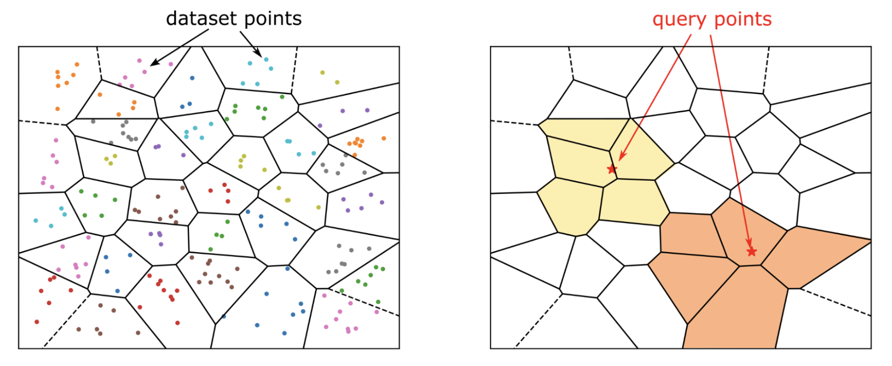

# MiniOB 向量数据库

## 向量搜索

向量搜索技术是非结构化数据检索的关键技术之一，通常通过近似最近邻搜索（Approximate Nearest Neighbor Search, ANN）的方式来在高维空间中进行检索，以此来找到满足要求的数据。向量搜索在检索相似的图片、音频和文本等方面发挥着关键作用。例如，在图像检索中，我们可以通过计算图像的特征向量，然后使用向量检索技术来找到与查询图像最相似的图像；在推荐系统中，我们可以通过计算用户和物品的特征向量，然后使用向量检索技术来找到与用户兴趣最相似的其他用户或物品。下面针对向量搜索技术的基本概念进行简要介绍。

### 向量（Vector）是什么

向量是一种表示多维特征的数据结构。每个向量由一组数值组成，这些数值通常对应于某种特定的特征或属性。例如，在图像处理中，一个向量可以表示图像的颜色、纹理等特征。为了更有效地管理非结构化数据，常见的做法是将其转换为向量表示，并存储在向量数据库中，这种转换过程通常被称为 Embedding。通过将文本、图像或其他非结构化数据映射到高维向量空间，我们可以捕捉数据的语义特征和潜在关系。单词、短语或整个文档以及图像、音频和其他类型的数据都可以表示成向量，例如，我们可以将下面的文本表示成向量：
```
"West Highland White Terrier": [0.0296700,0.0231020,0.0166550,0.0642470,-0.0110980, ... ,0.0253750]
```

### 向量数据库是什么

向量数据库是可以高效存储/检索向量的数据库。向量数据库用专门的数据结构和算法来处理向量之间的相似性计算和查询。通过构建索引结构，向量数据库可以快速找到最相似的向量。

### 向量搜索的应用

向量在检索相似的图片、音频和文本等方面发挥着关键作用，这源于其数据属性和特征表示能力。在机器学习和数据科学领域，向量被广泛用于描述数据特征。以图片数据为例，我们可以将其表示为向量。在计算机中，图片本质上是由像素构成的二维矩阵。每个像素的亮度值可视为图片的一个特征，因此，我们可以将这些亮度值串联成一个高维向量，从而实现图片的向量化表示。这种向量化表示使我们能够利用向量空间中的距离和相似度度量方法来比较不同图片之间的相似程度。例如，欧氏距离可用于衡量两个图片向量间的像素差异，而余弦相似度则可测量它们的方向差异。通过计算向量间的距离或相似度，我们可以量化评估不同图片之间的相似程度。

除此之外，检索增强生成（Retrieval-Augmented Generation）已经成为大语言模型应用的范式之一。而向量数据库是 RAG 应用中重要组成部分，向量数据库的存储容量、召回精度和召回速度在很大程度上影响了大语言模型应用的服务质量。

## MiniOB 向量数据库赛题

本次赛题，需要选手在 MiniOB 的基础上实现向量数据库的基本功能，向量数据库的功能被拆解为如下几个题目。

### 题目一：向量类型基础功能
* 向量类型
  * 语法：`vector(size)`，其中，size 表示向量的维度（必须指定）
  * 最大支持维度为 16000（在基础功能中只需要支持最大 1000 维向量即可）
  * 向量类型中的浮点数最多保留两位小数，并且去掉多余的0
* 支持创建包含向量类型的表：
```sql
CREATE TABLE items (id int, embedding vector(3));
```
* 支持插入向量类型的记录（注意：这里需要支持将字符串类型的值转换为向量类型存储）：
```sql
INSERT INTO items VALUES (1, '[1,2,3]');
```
* 支持向量类型的算术运算（加法（+），减法（-），乘法（*），比较运算）：
```sql
select embedding + '[1.5,2.3,3.3]', embedding - '[1,2,3]', '[1,2,3]' - embedding from items where embedding > '[0,0,0]';
```
其中，算术运算为逐个元素运算，如 `[1,2,3] + [1,1,1] = [2,3,4]`；比较运算为逐个元素的字典序比较，如`[1,2,3]<[1,2,4], [2,1,2]>[1,2,2]`

* 支持距离表达式计算：
  * l2_distance
    *  语法：l2_distance(vector A, vector B)
    * 计算公式：$[ D = \sqrt{\sum_{i=1}^{n} (A_{i} - B_{i})^2} ]$

  * cosine_distance：
    * 语法：cosine_distance(vector A, vector B)
    * 计算公式：$[ D = \frac{\mathbf{A} \cdot \mathbf{B}}{|\mathbf{A}| |\mathbf{B}|} = \frac{\sum_{i=1}^{n} A_i B_i}{\sqrt{\sum_{i=1}^{n} A_i^2} \sqrt{\sum_{i=1}^{n} B_i^2}} ]$

  * inner_product：
    * 语法：inner_product(vector A, vector B)
    * 计算公式：$[ D = \mathbf{A} \cdot \mathbf{B} = a_1 b_1 + a_2 b_2 + ... + a_n b_n = \sum_{i=1}^{n} a_i b_i ]$

  * 距离表达式的计算精度为保留2位小数。 

### 题目二：向量类型扩展

支持使用列表（如：`[1,2,3]`）来表示向量：
```sql
select embedding + [1.5,2.3,3.3], embedding - '[1,2,3]',[1,2,3] - embedding from items where embedding > [0,0,0];
```

### 题目三：高维向量

* 需要支持最大 16000 维向量的存储和检索。
* 不需要考虑在高维向量上建立向量索引。
* 高维向量的存储可以参考 TEXT 类型的实现。

### 题目四：向量索引（一）
在本次赛题中，需要实现 IVF-Flat 向量索引，下面简单介绍 IVF-Flat 向量索引的工作原理及相关语法。
IVF-Flat 是一种常见的高效近似最近邻（Approximate Nearest Neighbor，ANN）搜索算法，尤其适用于大型、高维向量数据集。它通过一种称为倒排文件索引（Inverted File Index）的机制来加速向量检索。IVF-Flat 的主要思想是将所有的高维向量分为多个簇，然后在每个簇内进行精确的向量搜索。这种方法通过减少需要比较的向量数量，大大提高了搜索速度。

具体来说，IVF-Flat 包括两个主要步骤：

* 向量分组（簇划分）：将所有向量通过聚类算法（如 K-Means）分为多个簇。每个簇都有一个中心点（质心），所有向量都分配到离它最近的质心。下面的左图表示将所有向量分为若干个簇。

* 倒排文件索引：建立一个倒排文件索引，将向量的索引存储在对应簇的列表中。然后，通过这个索引来快速锁定需要比较的向量集合。下面的右图表示向量索引检索的过程。


以图像搜索为例的 IVF-Flat 向量索引工作流程如下：
1. 首先使用 K-Means 算法将所有图像的特征向量分成 1000 个簇。每个簇表示一部分相似的图片。例如，簇 1 可能包含大部分是风景图像的向量，簇 2 可能包含大部分是人物图像的向量，以此类推。对于每个簇，向量索引都维护一个倒排文件索引，存储属于这个簇的所有图像的索引。
比如，簇 1 对应的倒排文件索引可能包括 [image_23, image_45, image_78...]，这些是属于簇 1 的图像的索引。
1. 查询过程：用户指定一张新图像进行搜索。首先，将这张图片通过同样的特征提取模型转换成一个高维向量。然后，通过计算这个向量与1000个质心的距离，找到离它最近的几个质心（假设是前5个）。在这几个质心对应的簇中，你进一步进行精确的向量搜索，找到最相似的图像。


向量索引语法：
```sql
CREATE VECTOR INDEX vector_idx 
ON items (embedding) 
WITH (distance=l2_distance, type=ivfflat, lists=245, probes=5);
```
其中 embedding 是向量索引列，必须指定是 vector 类型，`VECTOR INDEX` 必须搭配使用。vector_idx 是向量索引名，`WITH` 后面为创建向量索引的基本参数, 括号内部是一个表达式列表 其中的 distance 表示距离算法，必须是 `inner_product`，`l2_distance`，`cosine_distance` 其中的一种，type 为索引算法类型，当前只支持 ivfflat。distance 和 type 必须指定。注意：所有的关键字都是大小写不敏感的。

邻近向量检索语法：
```sql
select column_name1,column_name2, ... from table_name order by vector_distance_func(vector_column_name, '[float0,float1,……]') limit K;
```
* vector_distance_func是向量距离表达式：
  * l2_distance
  * inner_product
  * cosine_distance
* 要求order by子句表达式必须是一个向量距离表达式，且目前只支持向量列与常量向量
* 要求limit子句必须是一个整数常量表达式

本题目中只需要支持：
1. 创建 Ivf-Flat 向量索引（本题目不考察 ANN 查询）。
2. 当查询为邻近向量检索且命中向量索引时，需要将 order by + limit 的查询计划改写为通过向量索引进行检索的查询计划。

向量索引检索的查询计划示例如下：
```sql
EXPLAIN SELECT C1, L2_DISTANCE(C1, '[1,2,3]') FROM TEST ORDER BY L2_DISTANCE('[1,2,3]', C1) LIMIT 3;

Query Plan
OPERATOR(NAME)
PROJECT
└─VECTOR_INDEX_SCAN(V_I ON TEST)
```

### 题目五：向量索引题目（二）

* 需要在没有索引的场景下，支持向量检索功能（即精确检索）。
* 需要支持完整的向量检索功能（包括向量索引构建，向量索引查询）。

向量检索示例：
```sql
SELECT * FROM TAB_VEC ORDER BY L2_DISTANCE(B, '[1,2,3]') LIMIT 1;
```

### 题目六：ann-benchmarks

[ann-benchmarks](https://github.com/erikbern/ann-benchmarks) 是一个用于评估近似最近邻（Approximate Nearest Neighbor, ANN）搜索算法性能的工具和框架。我们使用 ann-benchmarks 来测试 MiniOB 向量搜索相关功能。
本地运行支持 MiniOB 的 ann-benchmarks 测试的步骤如下：

赛题测试程序中运行的 ann-benchmarks 只针对 `fashion-mnist-784-euclidean` 数据集进行测试，`--runs` 参数为1，测试使用的 python 脚本与 [ann-benchmarks](https://github.com/nautaa/ann-benchmarks/tree/miniob_ann) 完全相同，指定向量索引参数 `probes = 5, lists = 245`。
测试程序不对性能做过多的限制，满足如下要求即为通过：
1. 要求在 10 分钟内完成 ann-benchmarks 的整个运行（即包括：插入数据，创建索引，ANN 查询，不包括下载数据集的时间）。
2. 要求 ANN 查询的每秒查询数（QPS）达到 100 qps
3. 要求 ANN 查询的召回率（recall）达到 0.90
4. 考虑向量索引的内存占用，要求 ann-benchmarks 运行过程中 miniob 的最大内存占用不超过 1 GB。

注意: 需要对 MiniOB 代码进行修改，以支持运行 ann-benchmarks 测试（如MiniOB 现有的 MySQL 通讯协议需要兼容 ann-benchmarks 所使用的 pymysql）。

#### 在 MiniOB 上运行 ann-benchmark

1. 下载 ann-benchmarks 代码
```
git clone https://github.com/nautaa/ann-benchmarks.git -b miniob_ann
```
2. 安装所需 python 依赖
```
cd ann-benchmarks/
pip install -r requirements.txt
```
3. 以 mysql 通讯协议且监听 unix socket 的方式启动 miniob.
```bash
# 示例命令
/root/miniob/build_release/bin/observer -s /tmp/miniob.sock -P mysql 
```
4. 运行 ann-benchmark.
注意：需要将 `algorithms/miniob/config.yml` 中的 `arg_groups: [{unix_socket: "/tmp/miniob.sock"}]` 修改为 miniob 实际使用的 unix socket 文件地址
```bash
# 示例命令
python3 run.py --dataset fashion-mnist-784-euclidean --docker-tag ann-benchmarks-miniob --local --timeout 100 --runs 1
```
5. 生成运行结果.
```bash
# 示例命令
python3 plot.py --dataset fashion-mnist-784-euclidean
# 示例输出如下，其中每行结果倒数第一个值为该算法对应的QPS，每行结果倒数第二个值为该算法对应的召回率。
writing output to results/fashion-mnist-784-euclidean.png
Computing knn metrics
  0:                                                                   MiniOBVector()        0.968      167.476
Computing knn metrics
  1:                                                                 BruteForceBLAS()        1.000      355.359
```

### MiniOB 向量数据库语法示例

```sql
-- 建表语句
CREATE TABLE TEST (ID INT, C1 VECTOR(3), C2 VECTOR(3), C3 VECTOR(4));

-- 插入语句
INSERT INTO TEST VALUES(1, '[1,1,1]', '[1,2,3]', '[1,2,3,4]');

-- 查询语句
SELECT C1, C2, L2_DISTANCE(C1, C2), L2_DISTANCE('[1,1,1]', '[1,2,3]'), COSINE_DISTANCE('[1,1,1]', C2) FROM TEST;
SELECT C1, C2, C1 + '[1.5,2.3,3.3]', '[3.3,55.55,66.66]' - C2, C2 * C1 FROM TEST;

-- 创建索引
CREATE VECTOR INDEX V_I ON TAB_VEC(B) WITH(TYPE=IVFFLAT, DISTANCE=L2_DISTANCE, LISTS=3, PROBES=3);

-- ANN 查询
SELECT * FROM TAB_VEC ORDER BY L2_DISTANCE(B, '[1,2,3]') LIMIT 1;
```

## 参考资料
[向量数据库](https://en.wikipedia.org/wiki/Vector_database)

[pgvector](https://github.com/pgvector/pgvector)

[ivfflat 原理介绍](https://www.timescale.com/blog/nearest-neighbor-indexes-what-are-ivfflat-indexes-in-pgvector-and-how-do-they-work/)

[支持 MiniOB 的 ann-benchmarks fork 仓库](https://github.com/nautaa/ann-benchmarks/tree/miniob_ann)
