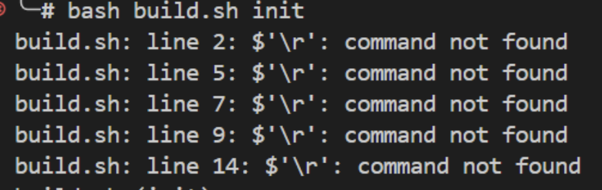
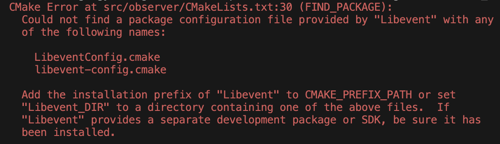
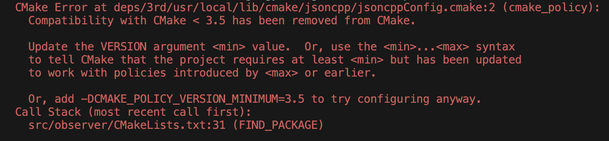

# 如何编译

## 0. base

假设系统上已经安装了make等编译工具。

MiniOB 需要使用：

- cmake 版本 >= 3.13
- gcc/clang gcc 11 以上，clang 14以上，编译器需要支持c++20新标准
- flex (2.5+), bison (3.7+) 用于生成词法语法分析代码

## 1. 环境初始化

如果是第一次在这个环境上编译miniob，需要安装一些miniob的依赖库，执行下面的命令即可安装：

> 重要提示：如果使用Windows系统，请先配置 git autocrlf 为 false。
> 执行：`git config --global core.autocrlf false`
> 防止脚本换行符被修改。

```bash
bash build.sh init
```

脚本将自动拉取依赖库(可以参考 .gitmodules) 然后编译安装到miniob源码目录的 `deps/3rd/usr/local` 下。

如果你想将第三方依赖安装到其它目录，比如 `/usr/local` 下，可以这样做：

```bash
THIRD_PARTY_INSTALL_PREFIX=/usr/local bash build.sh init
```

> 注意：安装到系统目录可能需要一些特殊权限，可能需要使用 `sudo` 来执行命令。

> 如果使用 GitPod、GitHub Devcontainer 或 miniob docker 容器开发，可以跳过这步，会自动执行。

## 2. 编译

执行下面的命令即可完成编译：

```bash
bash build.sh
```

此命令将编译一个DEBUG版本的miniob。如果希望编译其它版本的，可以参考 `bash build.sh -h`，比如：

```bash
bash build.sh release
```

此命令将编译release版本的miniob。

## 3. 运行

参考 [如何运行](how_to_run.md)

## FAQ

### 1. sudo找不到cmake

**Q:**

在“1. 环境初始化”中执行命令:

```bash
sudo bash build.sh init
```

时，报错:

```bash
build.sh: line xx: cmake: command not found
```

**A:**

- 1. 检查“0. base”中cmake版本要求是否满足。

```bash
cmake --version
```

- 2. 检查是否出现了“Linux系统下执行sudo命令环境变量失效现象”。

***检查***

在当前用户和root用户下均能找到cmake，而在当前用户下sudo cmake却找不到cmake，即:

```bash
[mu@vm-cnt8:~]$ sudo -E cmake --version
[sudo] password for mu: 
sudo: cmake: command not found
```

则可能就出现了“Linux系统下执行sudo命令环境变量失效现象”，本例中具体是PATH环境变量实效（被重置），导致找不到cmake。

***解决方法：建立软链接***

- 找到执行sudo命令时的PATH变量中有哪些路径：

```bash
[mu@vm-cnt8:~]$ sudo env | grep PATH
PATH=/sbin:/bin:/usr/sbin:/usr/bin
```

- 找到cmake所在的路径：

```bash
[mu@vm-cnt8:~]$ whereis cmake
cmake: /usr/local/bin/cmake /usr/share/cmake
```

- 在PATH变量中的一个合适路径下建立指向cmake的软链接：

```bash
[root@vm-cnt8:~]# ls /usr/bin | grep cmake
[root@vm-cnt8:~]# ln -s /usr/local/bin/cmake /usr/bin/cmake
[root@vm-cnt8:~]# ll /usr/bin | grep cmake
lrwxrwxrwx. 1 root root          20 Sep  1 05:57 cmake -> /usr/local/bin/cmake
```

***验证***

```bash
$ sudo -E cmake --version
cmake version 3.27.4
```

发现sudo时能找到cmake了，此时再执行

```bash
sudo bash build.sh init
```

则不会因为找不到cmake而报错。

### 2. build.sh: line 2: $'\r': command not found
在执行build.sh脚本时，遇到下面的错误


通常是使用Windows电脑下载源码，然后在docker或虚拟机中运行build.sh脚本运行时出现这个错误。

***解决方法：***

执行下面的脚本，设置git不要切换换行符。
```bash
git config --global core.autocrlf false
```
然后删除源码重新下载(clone)。

***问题原因：***
在Windows上git clone源码后，文本文件（包括build.sh）换行符被修改为 '\r\n'（CRLF），这个换行符在Linux上不能识别，Linux的换行符是'\n'(LF)。

**更多信息：**

关于该问题的更多细节，请参考[问题来源](https://ask.oceanbase.com/t/topic/35604437/7)。
关于该问题的进一步分析，请参考[Linux系统下执行sudo命令环境变量失效现象](https://zhuanlan.zhihu.com/p/669332689)。
也可以将cmake所在路径添加到sudo的PATH变量中来解决上述问题，请参考[sudo命令下环境变量实效的解决方法](https://www.cnblogs.com/xiao-xiaoyang/p/17444600.html)。

### 3. 构建错误：找不到 Libevent 或 jsoncpp

在执行 `build.sh init` 时可能出现以下错误：

  


### 🔍 原因

项目使用的第三方库 `libevent` 和 `jsoncpp` 依赖较老的 CMake 语法，与高版本 CMake（3.10+）不兼容，导致构建失败。

---

### ✅ 解决方案（二选一）

#### 方案一：快速修复（本地临时使用）

修改子模块中的 CMake 配置，放宽版本限制。

1. 修改 `libevent`：
```bash
sed -i 's|cmake_minimum_required(VERSION 3.1 FATAL_ERROR)|cmake_minimum_required(VERSION 3.1...3.8 FATAL_ERROR)|' deps/3rd/libevent/CMakeLists.txt
```
2. 修改 jsoncpp：
```bash
sed -i 's|cmake_policy(VERSION 3.0)|cmake_policy(VERSION 3.0...3.8)|' deps/3rd/jsoncpp/jsoncppConfig.cmake.in
```
重新初始化：
```bash
sudo bash build.sh init
```
⚠️ 注意：此修改仅为本地临时适配，请勿提交到 Git。

#### 方案二：根本解决（推荐，长期使用）

升级 libevent 和 jsoncpp 到支持现代 CMake 的新版。
```bash
# 更新 libevent
cd deps/3rd/libevent
git checkout main && git pull origin main
cd ../../..

# 更新 jsoncpp
```bash
cd deps/3rd/jsoncpp
git checkout master && git pull origin master
cd ../../..
```
推荐切换到稳定版本：

libevent: release-2.1.12-stable  
jsoncpp: 1.9.5 或更高  
提交更新：
```bash
git add deps/3rd/libevent deps/3rd/jsoncpp
git commit -m "chore: upgrade libevent and jsoncpp for CMake compatibility"
git push origin main
```
然后重新构建：
```bash
rm -rf build/  # 清理缓存
sudo bash build.sh init
```