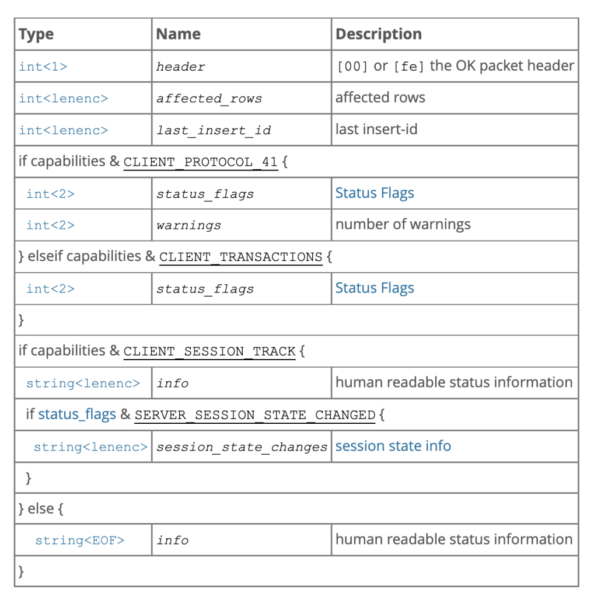
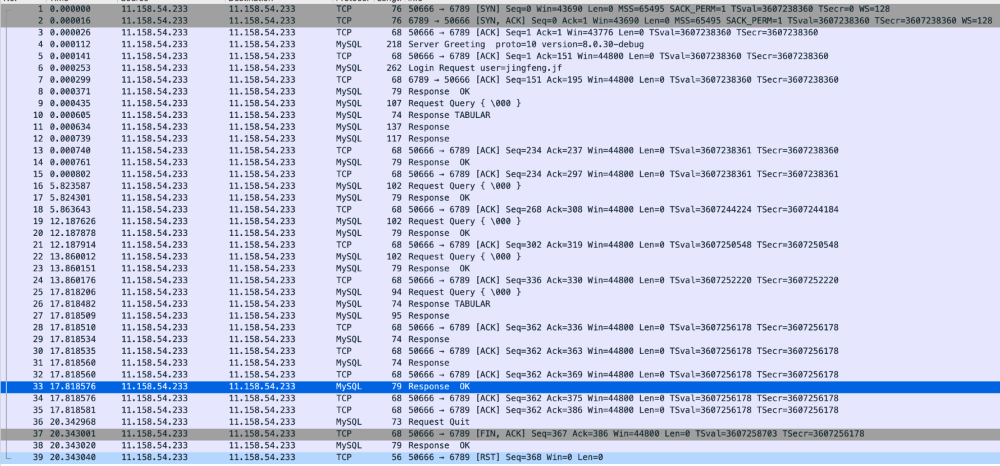

> 本篇文档介绍MySQL的通讯流程以及MiniOB对它的支持与实现

# MiniOB 通讯协议简介

MiniOB 支持使用客户端/服务端模式，客户端与服务端需要通过通讯来交互。当前服务端支持普通的文本协议与MySQL协议。
普通的文本协议非常简单，每个请求和应答都使用字符串来传递，字符串以'\0'字符结尾，因此文本协议不能支持二进制数据的传输。
MySQL 是一个非常流行的开源数据库，它有非常丰富的周边生态工具，如果MiniOB可以支持MySQL协议，后续就可以逐步扩展支持这些工具。

# MySQL 通讯协议

MySQL 服务端与客户端交互的过程。

1.  三次握手建立 TCP 连接。 
2.  建立 MySQL 连接，也就是认证阶段。
服务端 -> 客户端：发送握手初始化包 (Handshake Initialization Packet)。
客户端 -> 服务端：发送验证包 (Client Authentication Packet)。
服务端 -> 客户端：认证结果消息。 
3.  认证通过之后，客户端开始与服务端之间交互，也就是命令执行阶段。
客户端 -> 服务端：发送命令包 (Command Packet)。
服务端 -> 客户端：发送回应包 (OK Packet, or Error Packet, or Result Set Packet)。 
4.  断开 MySQL 连接。
客户端 -> 服务器：发送退出命令包。 
5.  四次握手断开 TCP 连接。

## MySQL Packet
MySQL 协议通过packet来交互。每个packet都包含一个packet header和packet payload。
packet header包含payload的长度和当前消息包的sequence。sequence是从1开始，每发出一个消息包，sequence都会加1。
每个消息包都由一些字段构成，字段的类型有很多种，主要有整形和字符串。每种类型又有多种编码方式，比如字符串有固定长度的、以'\0'结尾的和带长度编码的。这些可以参考 mysql_communicator.cpp::store_xxx 函数。

> 注意，MySQL协议中数字都是小端编码。而MiniOB没有对大小端做处理，所以当前只能运行在小端的机器上。

## 认证阶段
完成MySQL客户端与MiniOB的建连。
构造handshake包，解析验证包， 返回OK包，确保server与客户端的建连。

**握手包handshake格式**

在accept接收到新的连接时，server端需要先发起handshake握手包给客户端。

**认证报文**

这里有两次hash加密，基于随机挑战码和密码加密后返回给server端。

MyqlCommunicator::init是在刚接收到新的客户端连接时的接口，它会构造一个握手包发给客户端。在第一次接收客户端数据时，即在MysqlCommunicator::read_event中，如果判断还没有做过鉴权，就会做一个特殊处理，判断是否可以认证通过。不过当前MiniOB不会真的做密码验证。如果已经做过鉴权，就会认为接收的数据包是一个普通的命令消息。在接收到客户端的认证报文后，需要返回OK包给客户端。

**OK包报文**

## 请求交互阶段

在完成鉴权后，客户端就可以发送普通的请求命令到服务端，比如 "select * from t;" 查询语句。

MiniOB 仅考虑支持普通的文本查询命令。普通的文本查询命令，包格式也符合MySQL Packet的要求。其payload的第一个字节是command，接着就是请求命令，也就是SQL语句。

SQL请求的返回数据类型比较丰富，有OK、Error、EOF和ResultSet。
如果SQL请求不需要返回行数据，那直接返回处理结果即可，比如OK或者Error。
如果需要返回行数据，比如 "select * from t;" 查询请求，需要通过ResultSet包来返回客户端这些数据。有时候为了表示没有更多的数据，需要返回一个EOF包。

**OK/EOF包**

**Error包**

**ResultSet**

**抓包**

抓包可以很清晰的看到整个流程。

