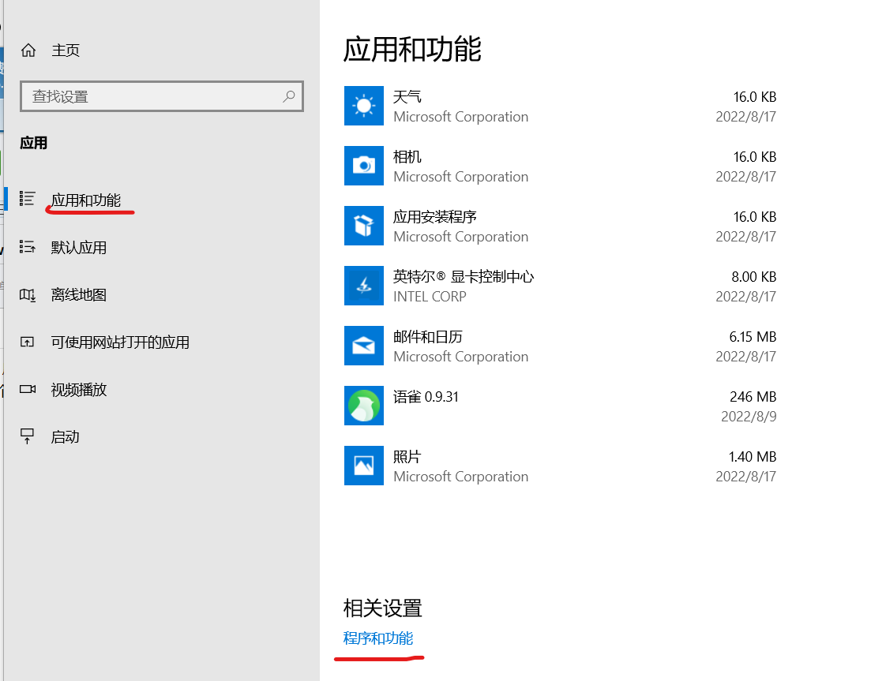
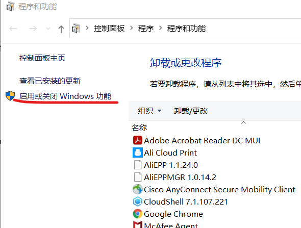
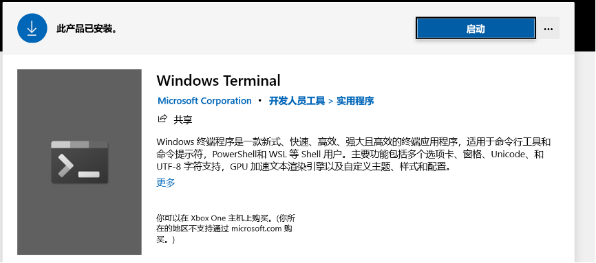
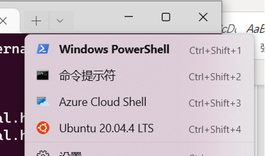
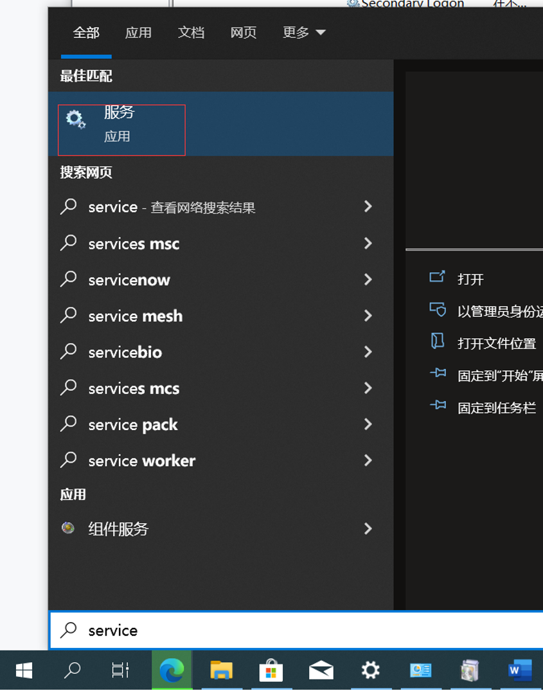
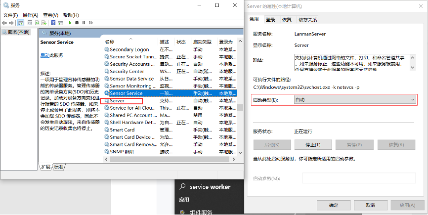

Windows 如何使用 Docker 开发miniob

miniob 是 OceanBase联合华中科技大学开发的一款帮助零基础开发者数据库开发实战的系统，目前已经开源，可以在GitHub网站查看：[miniob github首页](https://github.com/oceanbase/miniob)。

Miniob 是一个基于Linux的系统，可以在Linux和Mac上开发测试。使用Windows的同学，可以尝试Docker、Linux 子系统或者Cygwin等方式。本篇文章介绍在Windows系统上如何使用Docker来开发miniob。

# 安装Docker

Windows系统上默认不会安装Docker，需要自行安装。安装Docker有一些依赖，比如要开启电脑的虚拟化功能、Windows的Hyper-V 功能，具体操作可以参考这篇文档[在Windows系统上安装Docker](https://docs.microsoft.com/zh-cn/virtualization/windowscontainers/quick-start/set-up-environment?tabs=Windows-10-and-11)。

虽然文档已经比较详细，而且网上可以搜到大量的教程，这里还是给一些步骤提示。

## 如何开启电脑的虚拟化

以ThinkPad X1 Carbon 为例（不同的电脑可能会有些不同）

开机按 F1 进入：BIOS （不同的电脑进入BIOS的方式可能不同）

1. 选择：Security
2. 选择：Virtualization
3. 选择： 
   - Intel(R) Virturalization Technology=Enable
   - Intel(R) VT-d Feature=Enable

## 下载Docker Desktop
这个步骤没有什么特殊的，[下载](https://docs.docker.com/desktop/install/windows-install/)即可。

## 开启Windows 子系统
可以在Windows应用中找到Windows功能的开关，具体步骤以Windows 10为例，参考下面的步骤。





## 安装Docker
Windows应用程序的典型安装，点击下载好的安装包即可。

# 运行Docker

在PowerShell 中执行以下命令，下载并启动miniob镜像

```bash
docker run -d --name miniob --privileged oceanbase/miniob
```
其中 privileged 参数是为了方便在容器中进行调试。

运行下面的命令可以进入到容器并进行开发

```bash
docker exec -it miniob bash
```
这个命令可以在终端上执行多次，开启多个窗口方便操作。

到这里就可以结束了，但是为了方便后续的开发，还有一些建议。

1. 将代码放在自己的电脑上，Docker仅作为一个开发环境。启动镜像时这么做

```bash
docker run -d --name miniob --privileged -v $PWD/miniob:/root/miniob oceanbase/miniob
```
其中 `-v $PWD/miniob:/root/miniob` 是说将本地的 `$PWD/miniob` 目录映射到容器中的`/root/miniob` 目录，这里假设  `$PWD/miniob` 是你本地代码存放的位置，需要按照实际目录来调整。

代码放在自己的电脑上，好处是如果容器出现什么异常，自己最重要的数据不会丢失。

2. 启动镜像时忘记增加一些参数，但是又不想重新创建怎么办?

有时候启动镜像时（docker run），忘记增加一些参数，比如 `privileged`，但是又在容器中做了蛮多操作，对环境做了调整，不希望启动全新的容器，可以这么做

- 提交当前的容器，创建新的镜像

```bash
docker commit -m 'commit message' -t miniob:vx miniob
docker stop miniob
docker rm miniob
```

- 启动新的镜像

```bash
docker run -d --name miniob xxxx miniob:vx
```

> NOTE: 参数中 miniob:vx 中的vx 是一个版本号，你可以自己设置，每次使用不同的名字即可。

3. 在Windows上安装 Windows Terminal 应用

说实话，Windows自带的PowerShell和命令提示符实在太丑了，而且不支持配置。可以在应用商城中下载Windows Terminal 应用，此应用免费，默认界面非常漂亮并且支持多种终端。





# FAQ
- Docker Desktop requires the Server service to be enabled.
开启Windows服务即可
1. 搜索 service 应用


2. 开启server应用


- miniob 镜像中当前包含哪些信息
可以参考miniob镜像的网站首页：[miniob 镜像首页](https://hub.docker.com/r/oceanbase/miniob)

