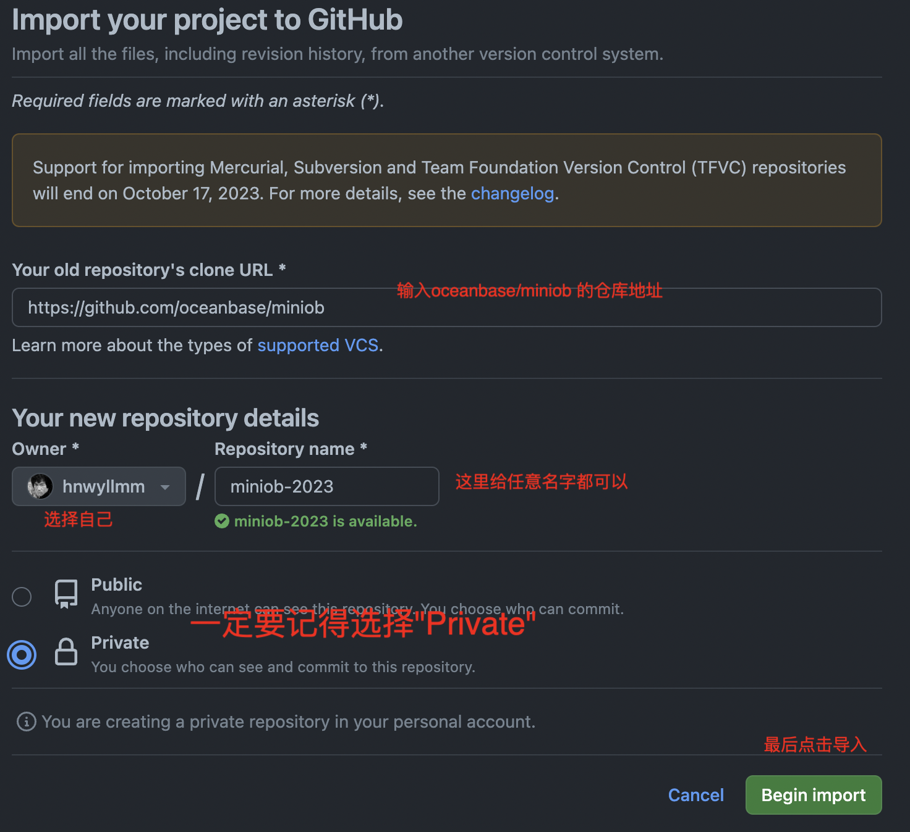
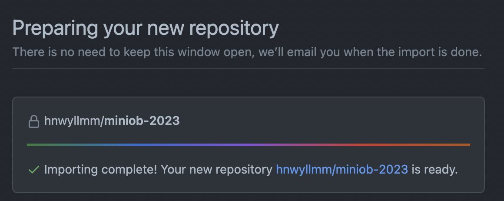
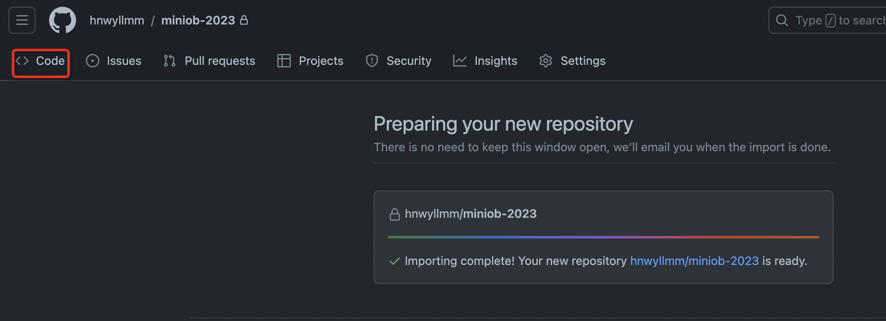
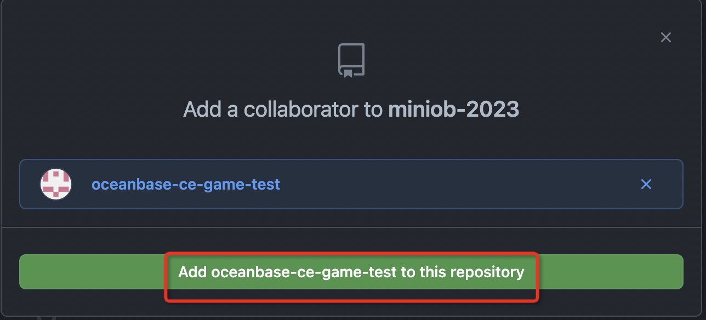
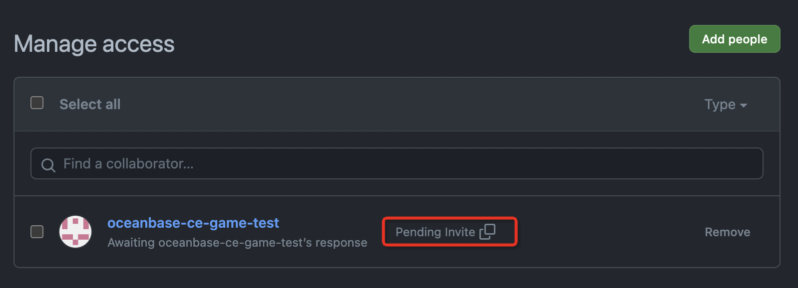
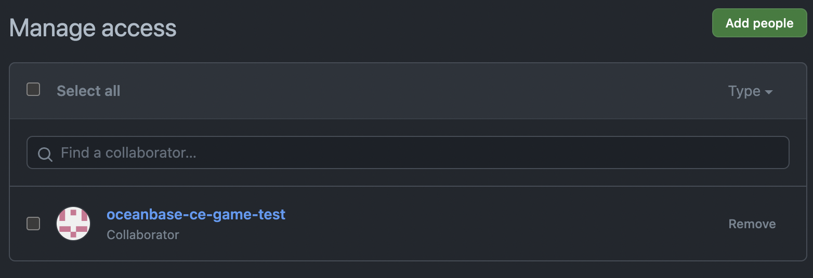

# MiniOB GitHub 在训练营中的使用说明

训练营测试后端现在支持使用 [GitHub](https://github.com) 和 [Gitee](https://gitee.com) 作为代码仓库管理平台。

本文介绍如何在GitHub上创建私有仓库，并将MiniOB代码提交到自己的仓库中，然后在训练营中进行测试。

MiniOB 仓库地址：<https://github.com/oceanbase/miniob>

训练营地址：<https://open.oceanbase.com/train>

## GitHub 私有仓库创建

首先你要有一个自己的GitHub账号。账号的注册流程比较简单，没有账号的同学登录GitHub网站创建即可。

1. 登录GitHub网站，并登录自己的账号

2. 在网站右上角点击 "Import Repository"


3. 填写导入表单

在"Your old repository's clone URL"项目中填写仓库的地址：

```
https://github.com/oceanbase/miniob
```



4. 点击"Begin import"按钮，开始导入仓库

导入会花费一定时间，导入完成后，可以看到：



5. 查看仓库首页

点击"Code" 标签，就可以进入到仓库首页。



6. 邀请OceanBase测试账号

点击"Settings"标签，进入仓库设置页面，点击"Collaborators"标签，进入仓库权限管理页面。


在"Search by username, full name or email address"中输入"oceanbase-ce-game-test"(官方测试账号)，点击"Add collaborator"按钮，即可将OceanBase测试账号添加到仓库中。




GitHub 在邀请别人加入仓库时，会发送邮件通知被邀请人，需要对方同意后，才能加入。
因此这个步骤需要等待，官方测试人员会定期刷新邮件处理邀请。如果长时间没有看到邀请成功的信息，请联系官方人员。
也可以直接将邀请链接发送给官方人员，邀请链接可以点击"Pending invite" 右侧的方形按钮复制。





7. 提交测试

等官网人员通过邀请后，就可以提交测试了。训练营的使用说明不再赘述，可以参考 [训练营使用说明](https://ask.oceanbase.com/t/topic/35600372)。
