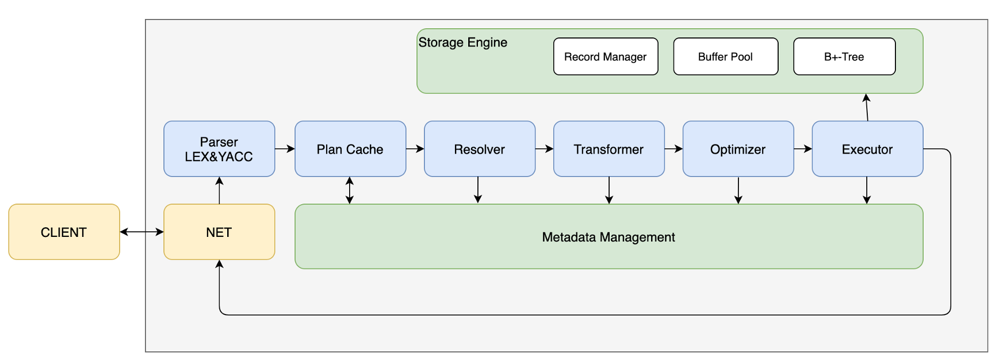

# miniob代码架构框架设计和说明

# miniob代码结构说明

## 背景
miniob设计的目标是让不熟悉数据库设计和实现的同学能够快速的了解与深入学习数据库内核，期望通过miniob相关训练之后，能够对各个数据库内核模块的功能与它们之间的关联有所了解，并能够在使用时，设计出高效的SQL。面向的对象主要是在校学生，并且诸多模块做了简化，比如不考虑并发操作。

## miniob结构
miniob作为一个具有“基本”功能的数据库，包含了需要的基本功能模块。包括

- 网络模块：负责与客户端交互，收发客户端请求与应答；

- SQL解析：将用户输入的SQL语句解析成语法树；

- 执行计划缓存：执行计划缓存模块会将该 SQL第一次生成的执行计划缓存在内存中，后续的执行可以反复执行这个计划，避免了重复查询优化的过程（未实现）。

- 语义解析模块：将生成的语法树，转换成数据库内部数据结构（部分实现）；

- 查询缓存：将执行的查询结果缓存在内存中，下次查询时，可以直接返回（未实现）；

- 查询优化：根据一定规则和统计数据，调整/重写语法树。当前实现为空，留作实验题目；

- 计划执行：根据语法树描述，执行并生成结果；

- 会话管理：管理用户连接、调整某个连接的参数；

- 元数据管理：记录当前的数据库、表、字段和索引元数据信息；

- 客户端：作为测试工具，接收用户请求，向服务端发起请求。

SQL的执行流程可以参考 

。

## 各模块工作原理介绍
### seda异步事件框架

miniob使用了seda框架，在介绍其它模块之前有必要先了解一下seda。
SEDA全称是：stage event driver architecture，它旨在结合事件驱动和多线程模式两者的优点，从而做到易扩展，解耦合，高并发。
各个stage之间的通信由event来传递，event的处理由stage的线程池异步处理。线程池内部会维护一个事件队列。
在miniob中，从接收请求开始，到SQL解析、查询优化、计划执行都使用event来传递数据，并且可以通过seda来配置线程池的个数。

### 服务端启动过程

虽然代码是模块化的，并且面向对象设计思想如此流行，但是很多同学还是喜欢从main函数看起。那么就先介绍一下服务端的启动流程。

main函数参考 main@src/observer/main.cpp。启动流程大致如下：

解析命令行参数 parse_parameter@src/observer/main.cpp

加载配置文件    Ini::load@deps/common/conf/ini.cpp

初始化日志       init_log@src/observer/init.cpp

初始化seda      init_seda@src/observer/init.cpp

初始化网络服务 init_server@src/observer/main.cpp

启动网络服务    Server::serve@src/net/server.cpp

建议把精力更多的留在核心模块上，以更快的了解数据库的工作。

### 网络模块
网络模块代码参考src/observer/net，主要是Server类。
在这里，采用了libevent作为网络IO工具。libevent的工作原理可以参考libevent官方网站。
网络服务启动时，会监听端口，接受到新的连接，会将新的连接描述字加入到libevent中。在有网络事件到达时（一般期望是新的消息到达），libevent会调用我们注册的回调函数(参考Server::recv@src/observer/net/server.cpp)。当连接接收到新的消息时，我们会创建一个SessionEvent(参考seda中的事件概念），然后交由seda调度。

### SQL解析
SQL解析模块是接收到用户请求，开始正式处理的第一步。它将用户输入的数据转换成内部数据结构，一个语法树。
解析模块的代码在`src/observer/sql/parser`下，其中`lex_sql.l`是词法解析代码，`yacc_sql.y`是语法解析代码，`parse_defs.h`中包含了语法树中各个数据结构。
对于词法解析和语法解析，原理概念可以参考《编译原理》。
其中词法解析会把输入（这里比如用户输入的SQL语句）解析成成一个个的“词”，称为token。解析的规则由自己定义，比如关键字SELECT，或者使用正则表达式，比如`"[A-Za-z_]+[A-Za-z0-9_]*"` 表示一个合法的标识符。
对于语法分析，它根据词法分析的结果（一个个token），按照编写的规则，解析成“有意义”的“话”，并根据这些参数生成自己的内部数据结构。比如`SELECT * FROM T`，可以据此生成一个简单的查询语法树，并且知道查询的`columns`是"*"，查询的`relation`是"T"。
NOTE：在查询相关的地方，都是用关键字relation、attribute，而在元数据中，使用table、field与之对应。

### 计划执行
在miniob的实现中，SQL解析之后，就直接跳到了计划执行，中间略去了很多重要的阶段，但是不影响最终结果。
计划执行的代码在`src/observer/sql/executor/`下，主要参考`execute_stage.cpp`的实现。

### seda编程注意事项
seda使用异步事件的方式，在线程池中调度。每个事件(event)，再每个阶段完成处理后，都必须调用done接口。比如 

- event->done(); // seda异步调用event的善后处理

- event->done_immediate(); // seda将直接在当前线程做event的删除处理

- event->done_timeout(); // 一般不使用

当前Miniob为了方便和简化，都执行`event->done_immediate`。

在event完成之后，seda会调用event的回调函数。通过 `event->push_callback` 放置回调函数，在event完成后，会按照`push_callback`的反向顺序调用回调函数。
注意，如果执行某条命令后，长时间没有返回结果，通过pstack也无法找到执行那条命令的栈信息，就需要检查下，是否有event没有调用done操作。
当前的几种event流程介绍：

`recv@server.cpp`接收到用户请求时创建`SessionEvent`并交给`SessionStage`

`SessionStage`处理`SessionEvent`并创建`SQLStageEvent`，流转->

`ParseStage` 处理 `SQLStageEvent` 流转到->

`ResolveStage` 流转 `SQLStageEvent` ->

`QueryCacheStage` 流转 `SQLStageEvent` ->

`PlanCacheStage` 流转 `SQLStageEvent` ->

`OptimizeStage` 流转 `ExecutionPlanEvent` ->

`ExecuteStage` 处理 `ExecutionPlanEvent` 并创建 `StorageEvent`，流转到->

`DefaultStorageStage` 处理 `StorageEvent`

### 元数据管理模块
元数据是指数据库一些核心概念，包括db、table、field、index等，记录它们的信息。比如db，记录db文件所属目录；field，记录字段的类型、长度、偏移量等。代码文件分散于`src/observer/storage/table,field,index`中，文件名中包含`meta`关键字。

### 客户端
这里的客户端提供了一种测试miniob的方法。从标准输入接收用户输入，将请求发给服务端，并展示返回结果。这里简化了输入的处理，用户输入一行，就认为是一个命令。

### 通信协议
miniob采用TCP通信，纯文本模式，使用'\0'作为每个消息的终结符。
注意：测试程序也使用这种方法，***请不要修改协议，后台测试程序依赖这个协议***。
注意：返回的普通数据结果中不要包含'\0'，也不支持转义处理。

当前MiniOB已经支持了MySQL协议，具体请参考[MiniOB 通讯协议简介](./design/miniob-mysql-protocol.md)。

# 参考
- 《数据库系统实现》
- 《数据库系统概念》
- 《flex_bison》  flex/bison手册
- [flex开源源码](https://github.com/westes/flex)
- [bison首页](https://www.gnu.org/software/bison/)
- [cmake官方手册](https://cmake.org/)
- [libevent官网](https://libevent.org/)
- [SEDA wiki百科](https://en.wikipedia.org/wiki/Staged_event-driven_architecture)
- [OceanBase数据库文档](https://www.oceanbase.com/docs)
- [OceanBase开源网站](https://github.com/oceanbase/oceanbase)

# 附录-编译安装测试

## 编译
参考 [如何构建MiniOB](./how_to_build.md) 文件。

## 运行服务端
参考 [如何运行MiniOB](./how_to_run.md)。
